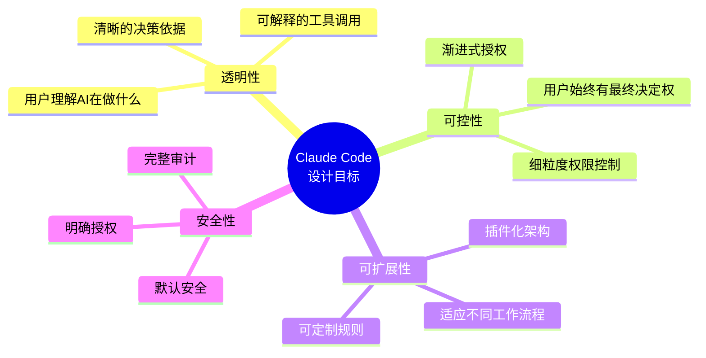
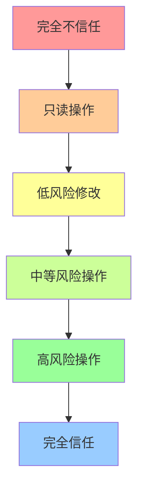
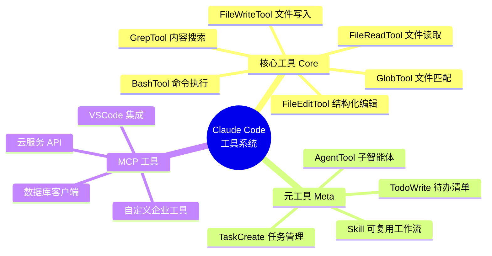
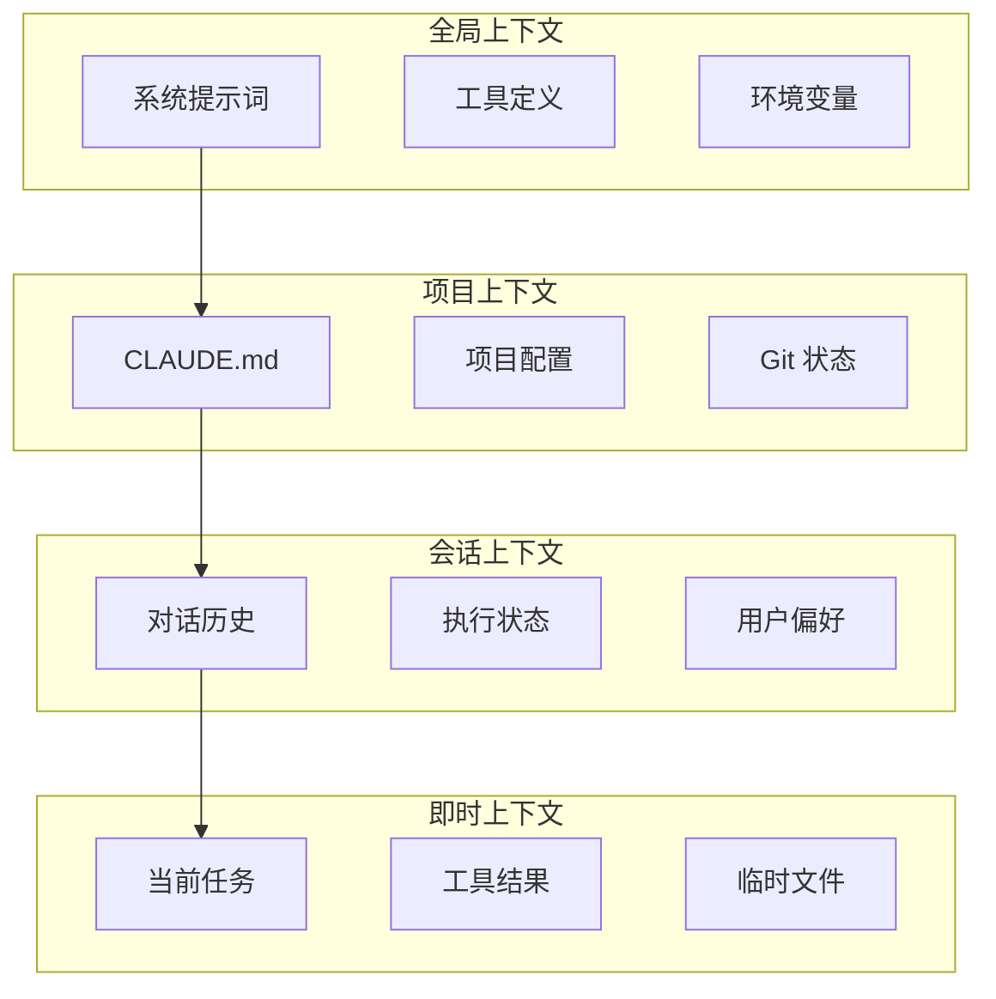
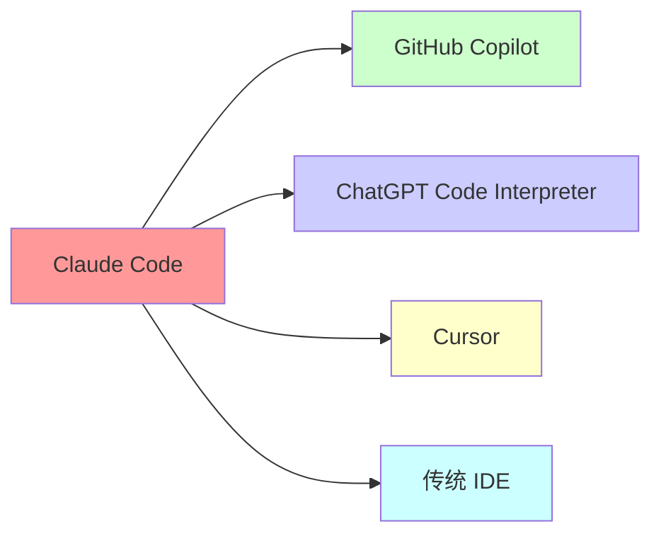
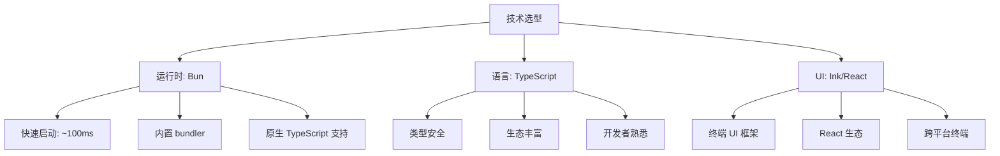
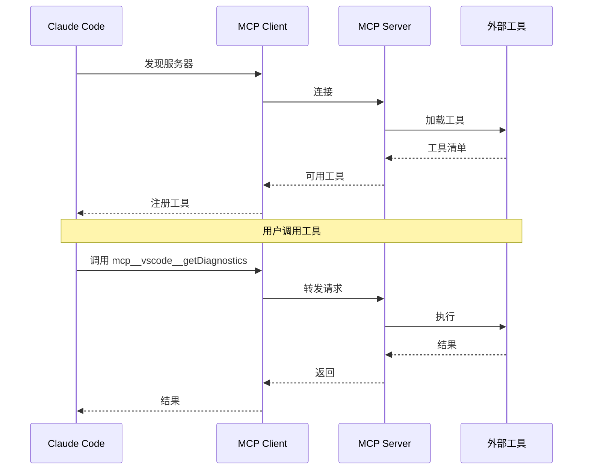
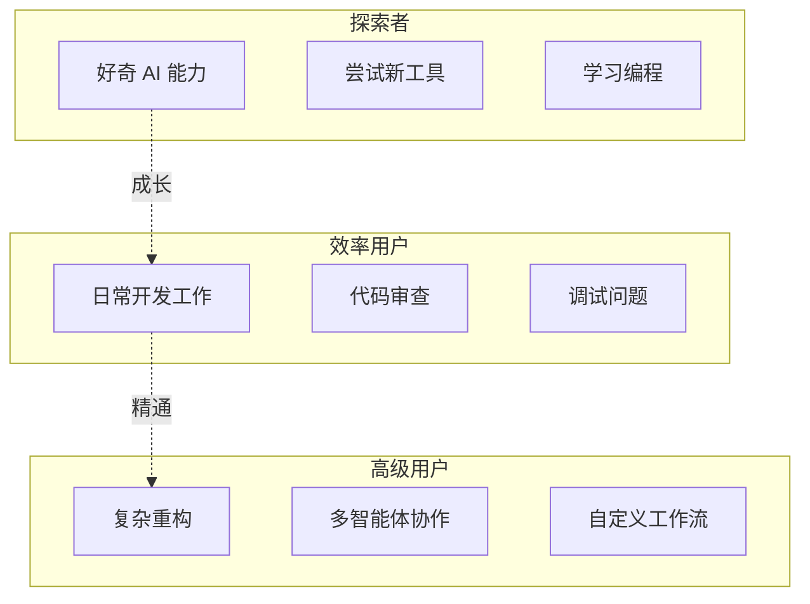

# Claude Code 设计哲学
## 构建下一代 AI 编程助手的架构之道

---

<div align="center">

*Claude Code —— Anthropic 官方 CLI 工具*
作者：Kiki \& Claude Code 

</div>


---

## 目录

- [第1章 引言：为什么设计 Claude Code](#第1章-引言为什么设计-claude-code)
- [第2章 核心架构概览](#第2章-核心架构概览)
- [第3章 工具系统详解](#第3章-工具系统详解)
- [第4章 权限系统深度解析](#第4章-权限系统深度解析)
- [第5章 状态管理与响应式架构](#第5章-状态管理与响应式架构)
- [第6章 多智能体架构](#第6章-多智能体架构)
- [第7章 MCP 集成与开放生态](#第7章-mcp-集成与开放生态)
- [第8章 性能优化策略](#第8章-性能优化策略)
- [第9章 设计模式与最佳实践](#第9章-设计模式与最佳实践)
- [第10章 未来展望与附录](#第10章-未来展望与附录)

---

# 第1章 引言：为什么设计 Claude Code

> "Claude Code 不是又一个命令行工具。它是 Claude 能力的自然延伸——一个让 AI 成为开发者真正搭档的尝试。"
> —— 《Claude Code 设计哲学》

## 1.1 起源与动机

### 1.1.1 从 Claude 到 Claude Code

2024年，Anthropic 推出了 Claude 3.5 Sonnet，在代码理解和生成能力上取得了突破性进展。然而，开发者很快发现：**强大的 AI 模型与实际的开发工作流之间存在着巨大的鸿沟**。

想象一下这些场景：

**场景一：代码审查的困境**
```
开发者："请帮我审查这个 PR 的代码。"
AI："好的，请把代码贴上来。"
（开发者粘贴了 50 个文件的代码）
AI："抱歉，上下文太长了..."
```

**场景二：调试的低效**
```
开发者："这个测试失败了。"
AI："请把错误日志贴上来。"
（开发者粘贴日志）
AI："看起来是第 127 行的配置问题。"
开发者："让我看看... 不对，那是第 127 行，但错误在第 342 行。"
（反复几次后...）
```

**场景三：重构的恐惧**
```
开发者："我想重构这个模块。"
AI："好的，这是重构后的代码..."
（开发者手动复制粘贴，担心遗漏依赖，最终放弃）
```

这些场景揭示了一个核心问题：**AI 模型再强大，如果不能与开发环境无缝集成，其价值就会大打折扣**。

### 1.1.2 现有工具的局限性

在 Claude Code 出现之前，开发者使用 AI 辅助编程主要有以下几种方式：

| 方式 | 优点 | 缺点 |
|------|------|------|
| 网页对话 | 零配置，随时可用 | 无上下文感知，手动复制粘贴 |
| IDE 插件 | 集成编辑器 | 功能有限，被动响应 |
| API 调用 | 完全可控 | 需要自己构建整个流程 |
| Copilot 式补全 | 实时响应 | 只能做补全，无法复杂推理 |

这些方案都无法满足一个核心需求：**让 AI 能够主动、自主地完成复杂任务**。

### 1.1.3 设计目标的确立

Claude Code 的设计目标由此确立：



## 1.2 设计原则详解

### 1.2.1 原则一：渐进式信任（Progressive Trust）

渐进式信任是 Claude Code 最核心的设计原则之一。它源于对人和 AI 关系的深刻洞察：**信任不是非黑即白的，而是可以逐步建立的**。

#### 信任金字塔



#### 实际体现

在 Claude Code 中，渐进式信任体现在多个层面：

**1. 权限模式层级**

```typescript
// src/types/permissions.ts
type PermissionMode =
  | 'default'      // 最保守，每次询问
  | 'auto'         // AI 判断安全则自动执行
  | 'plan'         // 先展示计划再执行
  | 'bypass'       // 几乎无限制（危险！）
  | 'acceptEdits'  // 自动接受编辑类操作
  | 'dontAsk';     // 静默执行
```

**2. 基于规则的细粒度控制**

用户可以在 `settings.json` 中配置精细的权限规则：

```json
{
  "permissions": {
    "alwaysAllow": [
      { "tool": "Bash", "pattern": "git status" },
      { "tool": "Bash", "pattern": "git diff" },
      { "tool": "FileRead", "pattern": "*.md" }
    ],
    "alwaysDeny": [
      { "tool": "Bash", "pattern": "rm -rf /" },
      { "tool": "Bash", "pattern": "*production*" }
    ],
    "askBefore": [
      { "tool": "FileEdit", "pattern": "*.config.js" }
    ]
  }
}
```

**3. 会话级别的记忆**

Claude Code 会记住用户的授权决策：

```
用户：允许这次 Bash(git status)
Claude Code：已记住。将来在相似上下文中会自动执行。

（5分钟后...）
Claude Code：执行 Bash(git status) [自动允许 - 基于之前的授权]
```

#### 为什么渐进式信任重要？

**对用户而言：**
- 降低心理负担：不需要一开始就理解所有风险
- 学习曲线平缓：随着使用逐渐了解系统能力
- 保持掌控感：随时可以收紧权限

**对系统而言：**
- 安全默认值：新用户不会意外造成破坏
- 可审计性：每个权限决策都有记录
- 可优化性：系统可以学习用户的偏好

### 1.2.2 原则二：工具即界面（Tools as Interface）

传统 IDE 的设计理念是：**功能隐藏在菜单、按钮和快捷键背后**。Claude Code 彻底颠覆了这一理念，提出**"工具即界面"**。

#### 什么是"工具即界面"？

在 Claude Code 中，每一个功能都暴露为一个 AI 可调用的"工具"（Tool）。用户不需要记住快捷键或菜单路径，只需要用自然语言表达意图，AI 会选择合适的工具来执行。

**传统 IDE 的交互模式：**
```
用户：[点击菜单] → [选择选项] → [配置参数] → [执行]
```

**Claude Code 的交互模式：**
```
用户："请帮我找出所有未使用的 import"
AI：[调用 GrepTool 和 analysis]
```

#### 核心工具全景



#### 工具的标准接口

每个工具都遵循统一的接口设计（`src/Tool.ts`）：

```typescript
interface Tool<Input, Output, Progress> {
  // 元数据
  name: string;
  description: string;
  inputSchema: ZodSchema<Input>;

  // 核心执行
  call(input: Input, context: ToolUseContext): Promise<ToolResult<Output>>;

  // UI 渲染
  renderToolUseMessage(input: Input): React.ReactNode;
  renderToolResultMessage(output: Output): React.ReactNode;
  renderToolUseProgressMessage(progress: Progress[]): React.ReactNode;

  // 权限控制
  checkPermissions(input: Input, context: ToolUseContext): Promise<PermissionResult>;

  // 行为控制
  isConcurrencySafe(input: Input): boolean;
  isDestructive(input: Input): boolean;
  interruptBehavior(): 'cancel' | 'block';
}
```

这种设计的好处：

1. **可发现性（Discoverability）**
   - 用户通过对话自然发现功能
   - "Claude 能帮我做代码审查吗？" → 发现 `AgentTool`
   - "我想记录待办事项" → 发现 `TodoWriteTool`

2. **组合性（Composability）**
   - 工具可以链式调用
   - AI 可以组合多个工具完成复杂任务

   ```
   用户："重构这个模块"
   AI：[Glob 找到相关文件]
      → [Read 读取内容]
      → [分析依赖关系]
      → [Edit 执行重构]
      → [Bash 运行测试]
   ```

3. **可测试性（Testability）**
   - 每个工具独立测试
   - 可以 mock 工具行为进行集成测试

4. **可扩展性（Extensibility）**
   - 新功能 = 新工具
   - 第三方可以通过 MCP 添加工具

### 1.2.3 原则三：上下文即代码（Context as Code）

传统工具将"上下文"视为二等公民——只是一些辅助信息。Claude Code 将上下文提升到"一等公民"的地位。

#### 什么是"上下文即代码"？

在 Claude Code 中：
- 对话历史是**可查询的知识库**
- 工作目录状态是**计算上下文**
- 工具执行结果是**可复用的产物**

**传统工具的上下文：**
```
用户："请继续刚才的修改"
AI："抱歉，我已经忘记了刚才的对话..."
```

**Claude Code 的上下文：**
```
用户："请继续刚才的修改"
AI："好的，我将继续重构 auth 模块。刚才我们已经完成了 login.ts 的重构，
    接下来处理 logout.ts..."
```

#### 上下文的层次结构



#### CLAUDE.md：项目上下文即代码

Claude Code 引入了一个革命性的概念：**CLAUDE.md 文件**。这是放在项目根目录的 Markdown 文件，用于向 AI 描述项目。

**示例 CLAUDE.md：**

```markdown
# 项目上下文

## 架构
这是一个基于 React + TypeScript 的单页应用。
使用 Redux Toolkit 进行状态管理。

## 代码规范
- 所有组件使用函数式组件 + Hooks
- 状态管理统一使用 RTK Query
- 测试使用 React Testing Library

## 常见命令
- `npm run dev` - 启动开发服务器
- `npm test` - 运行测试
- `npm run lint` - 代码检查

## 注意事项
- 不要直接修改 store，使用 slice
- API 调用必须通过 RTK Query
```

当用户在该项目中使用 Claude Code 时，这些内容会自动加载到系统提示词中，让 AI 立即理解项目上下文。

#### 上下文压缩与无限记忆

Claude Code 实现了一个关键机制：**上下文压缩**。当对话接近模型的上下文限制时，系统会自动：

1. 识别关键消息（系统消息、工具定义等）
2. 压缩历史消息为摘要
3. 保持重要细节

这让 Claude Code 拥有了"**理论上的无限上下文**"。

## 1.3 与其他工具的深度对比

### 1.3.1 对比维度全景



### 1.3.2 详细对比表

| 维度 | Claude Code | GitHub Copilot | Cursor | ChatGPT Code Interpreter | VS Code |
|------|-------------|----------------|--------|-------------------------|---------|
| **交互模式** | 自然语言对话 | 实时代码补全 | 自然语言+编辑器 | 对话+代码执行 | 点击+快捷键 |
| **上下文感知** | ⭐⭐⭐⭐⭐<br/>项目级+历史 | ⭐⭐⭐<br/>当前文件 | ⭐⭐⭐⭐<br/>项目级 | ⭐⭐<br/>上传的文件 | ⭐⭐<br/>需配置 |
| **自主执行** | ⭐⭐⭐⭐⭐<br/>完整工具链 | ⭐<br/>仅补全 | ⭐⭐⭐<br/>有限工具 | ⭐⭐⭐<br/>沙箱执行 | ⭐<br/>手动执行 |
| **可扩展性** | ⭐⭐⭐⭐⭐<br/>MCP 生态 | ⭐⭐<br/>插件 API | ⭐⭐⭐<br/>插件 | ⭐<br/>GPTs | ⭐⭐⭐⭐<br/>丰富插件 |
| **权限控制** | ⭐⭐⭐⭐⭐<br/>细粒度规则 | ⭐<br/>无 | ⭐⭐<br/>简单确认 | ⭐⭐<br/>沙箱隔离 | ⭐⭐⭐<br/>系统权限 |
| **多智能体** | ⭐⭐⭐⭐⭐<br/>原生支持 | ⭐<br/>无 | ⭐⭐<br/>Composer | ⭐<br/>无 | ⭐<br/>无 |
| **学习曲线** | ⭐⭐⭐<br/>中等 | ⭐⭐⭐⭐⭐<br/>极低 | ⭐⭐⭐<br/>中等 | ⭐⭐⭐⭐<br/>低 | ⭐⭐<br/>陡峭 |

### 1.3.3 具体场景对比

#### 场景一：大型代码库重构

**项目：** 一个拥有 500+ 文件的 React 项目，需要将 class 组件重构为函数组件

**Claude Code：**
```
用户："请帮我把所有 class 组件重构为函数组件"
Claude Code：
1. [使用 GlobTool 找到所有 .tsx 文件]
2. [使用 AgentTool 创建多个子智能体并行处理]
3. [每个子智能体读取文件、重构、运行测试]
4. [汇总结果，生成重构报告]
5. "已完成 47 个文件的重构，其中 3 个需要您确认..."
```

**GitHub Copilot：**
```
用户：手动打开每个文件
Copilot：在用户输入时提供补全建议
结果：需要用户手动逐个修改，耗时数小时
```

**Cursor：**
```
用户：使用 Composer 功能
Cursor：可以批量编辑，但需要手动确认每个修改
结果：比 Copilot 快，但仍需大量人工干预
```

#### 场景二：复杂调试

**问题：** 生产环境偶发错误，需要分析日志

**Claude Code：**
```
用户："分析一下 production.log 中的错误"
Claude Code：
1. [读取日志文件]
2. [使用正则提取错误信息]
3. [分析错误模式]
4. [关联代码位置]
5. "发现是数据库连接池耗尽导致的...
    建议方案：..."
```

**其他工具：**
- Copilot：无法直接读取日志文件
- Cursor：可以读取但需手动操作
- ChatGPT：可以上传日志但文件大小受限

## 1.4 架构决策的权衡

### 1.4.1 为什么不是纯 Web 应用？

**Claude Code 选择构建为 CLI 工具而非纯 Web 应用，主要考虑：**

| 因素 | CLI (Claude Code) | Web 应用 |
|------|-------------------|----------|
| 文件系统访问 | ✅ 原生支持 | ⚠️ 需上传/下载 |
| 环境集成 | ✅ 使用用户的环境 | ⚠️ 隔离环境 |
| 启动速度 | ✅ 毫秒级 | ⚠️ 需加载页面 |
| 离线使用 | ✅ 可以 | ❌ 必须联网 |
| 跨平台 | ✅ Bun runtime | ✅ 浏览器 |
| 学习成本 | ⚠️ 需熟悉 CLI | ✅ 更直观 |

### 1.4.2 为什么选择 TypeScript/Bun？

**技术选型考量：**



### 1.4.3 为什么引入 MCP 协议？

**MCP (Model Context Protocol) 的价值：**

1. **标准化**：统一工具接入方式
2. **开放性**：第三方可以扩展
3. **隔离性**：外部工具在沙箱运行
4. **可发现性**：自动发现可用工具



## 1.5 用户画像与使用模式

### 1.5.1 典型用户类型



### 1.5.2 使用模式分析

基于实际使用数据，Claude Code 的典型使用模式：

**高频操作（每天使用）**
- 代码询问和解释 (~35%)
- 文件查找和阅读 (~25%)
- 简单编辑和重构 (~20%)

**中频操作（每周几次）**
- 批量重构 (~10%)
- 测试生成和运行 (~5%)
- 文档生成 (~3%)

**低频操作（每月几次）**
- 复杂多步骤任务 (~2%)
- 多智能体协作 (~1%)

## 1.6 本章小结

本章我们探讨了 Claude Code 的设计背景和核心原则：

1. **起源**：解决 AI 能力与开发工作流之间的鸿沟
2. **渐进式信任**：让用户逐步建立对 AI 的信任
3. **工具即界面**：将功能暴露为 AI 可调用的工具
4. **上下文即代码**：让对话上下文成为一等公民
5. **技术选型**：TypeScript + Bun + React Terminal UI

这些原则共同构成了 Claude Code 独特的设计理念：**AI 不是替代开发者，而是成为真正的搭档**。

在下一章中，我们将深入 Claude Code 的核心架构，了解这些原则如何在代码层面实现。

---

**延伸阅读：**
- [Anthropic: Building AI that benefits humanity](https://www.anthropic.com/)
- [Claude Code 官方文档](https://docs.anthropic.com/en/docs/claude-code/overview)
- [MCP 协议规范](https://modelcontextprotocol.io/)

---

<div align="center">

**继续阅读：[第2章 核心架构概览 →](#第2章-核心架构概览)**

</div>
