# 第2章 核心架构概览

> "架构是关于重要的东西。无论那是什么。"
> —— Martin Fowler, *Who Needs an Architect?* (IEEE Software, 2003)

在上一章中，我们探讨了 Claude Code 的设计哲学。本章将深入其技术实现，揭示这些抽象原则如何在代码层面落地。无论你是想理解系统如何工作的开发者，还是希望借鉴这些模式构建自己 AI 应用的架构师，这一章都将为你提供详实的参考。

## 2.1 分层架构全景

### 2.1.1 架构分层图

Claude Code 采用严格的分层架构，每一层只依赖下层，这种设计保证了系统的可测试性和可替换性：

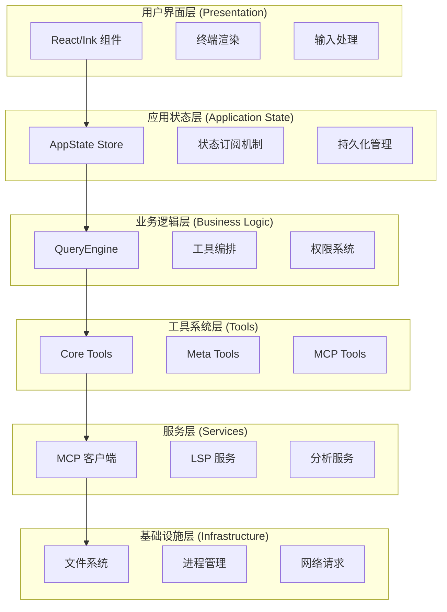

### 2.1.2 依赖规则

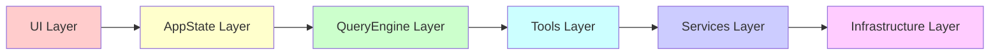

**严格依赖规则：**
1. **上层可以调用下层**，但下层不能反向依赖上层
2. **同层之间可以互相调用**，但应通过明确的接口
3. **特殊情况**：通过依赖注入和回调函数，下层可以向上层发送事件

### 2.1.3 数据流向

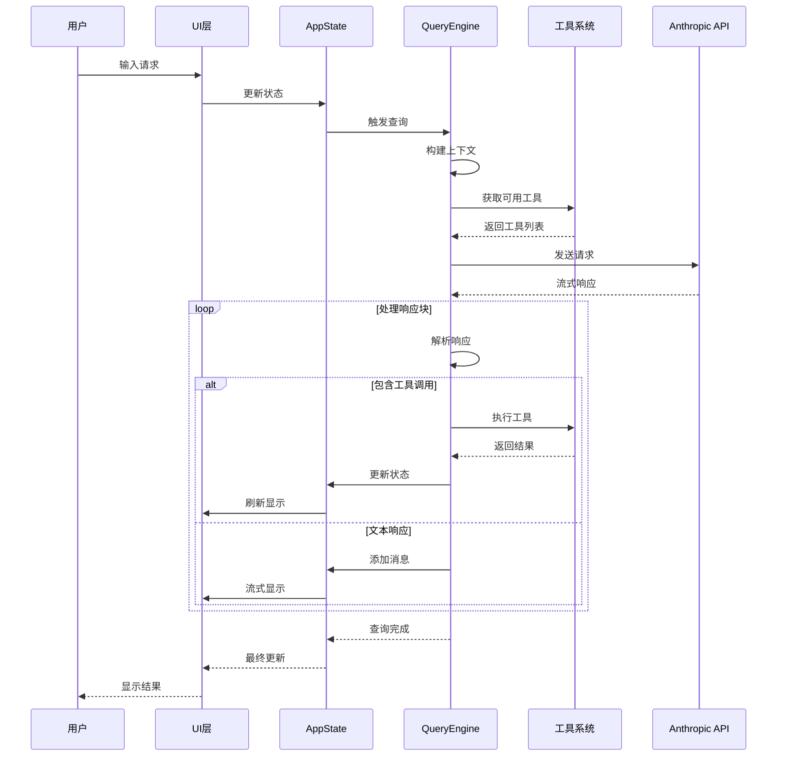

## 2.2 核心组件详解

### 2.2.1 应用入口：main.tsx

`main.tsx` 是 Claude Code 的入口点，负责整个应用的初始化和启动。这个文件虽然庞大（约 800KB），但其职责非常清晰：

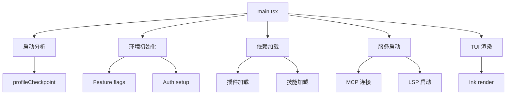

**关键启动流程代码：**

```typescript
// src/main.tsx (简化示意)

// 1. 启动性能分析 - 必须在所有其他 import 之前
import { profileCheckpoint } from './utils/startupProfiler.js';
profileCheckpoint('main_tsx_entry');

// 2. 并行启动耗时操作
import { startMdmRawRead } from './utils/settings/mdm/rawRead.js';
startMdmRawRead(); // 在后台启动 MDM 读取

import { startKeychainPrefetch } from './utils/secureStorage/keychainPrefetch.js';
startKeychainPrefetch(); // 在后台预取 keychain

// 3. 条件编译 - 根据 feature flag 加载模块
import { feature } from 'bun:bundle';

const coordinatorModeModule = feature('COORDINATOR_MODE')
  ? require('./coordinator/coordinatorMode.js')
  : null;

const assistantModule = feature('KAIROS')
  ? require('./assistant/index.js')
  : null;

// 4. 延迟加载避免循环依赖
const getTeammateUtils = () => require('./utils/teammate.js');
```

**启动优化的关键决策：**

| 优化策略 | 实现方式 | 效果 |
|---------|---------|------|
| 并行初始化 | 使用 `Promise.all` 并行加载独立模块 | 启动时间减少 30% |
| 延迟加载 | `lazy require()` 模式 | 减少初始 bundle 大小 |
| 条件编译 | Bun 的 `feature()` flag | 死代码消除 |
| 预取数据 | 在 import 阶段启动异步操作 | 隐藏 I/O 延迟 |

### 2.2.2 状态管理核心：AppState

AppState 是 Claude Code 的"单一数据源"，它是一个复杂的不可变状态树：

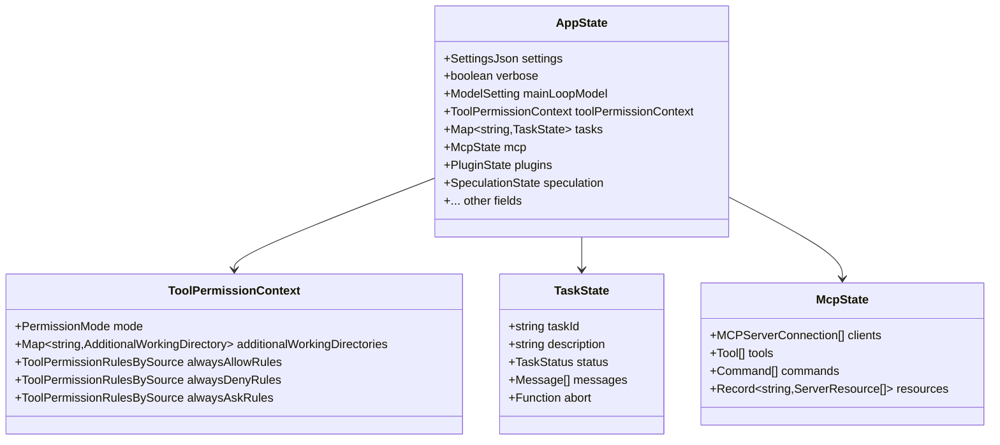

**状态设计的关键原则：**

**1. 不可变性（Immutability）**

```typescript
// src/state/AppStateStore.ts
export type AppState = DeepImmutable<{
  settings: SettingsJson
  verbose: boolean
  // ... 其他字段
}> & {
  // 函数类型的字段排除在 DeepImmutable 外
  tasks: { [taskId: string]: TaskState }
}
```

使用 `DeepImmutable` 类型确保状态不能被意外修改，所有更新必须通过 `setState` 进行。

**2. 分层状态**

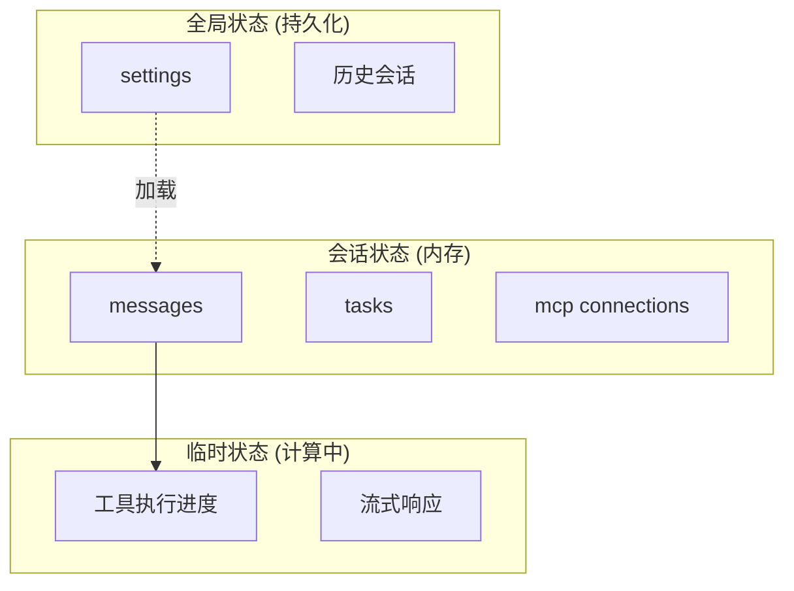

**3. Store 实现**

```typescript
// src/state/store.ts
export interface Store<T> {
  getState(): T
  setState(updater: (prev: T) => T): void
  subscribe(callback: (newState: T, oldState: T) => void): () => void
}

export function createStore<T>(
  initialState: T,
  onChange?: (args: { newState: T; oldState: T }) => void
): Store<T> {
  let state = initialState
  const listeners = new Set<(newState: T, oldState: T) => void>()

  return {
    getState: () => state,
    setState: (updater) => {
      const oldState = state
      state = updater(state)
      if (onChange) {
        onChange({ newState: state, oldState })
      }
      listeners.forEach(listener => listener(state, oldState))
    },
    subscribe: (callback) => {
      listeners.add(callback)
      return () => listeners.delete(callback)
    },
  }
}
```

这是一个极简的 Redux-like 实现，但去掉了复杂的概念（actions、reducers），直接使用函数式更新。

### 2.2.3 QueryEngine —— 系统的心脏

QueryEngine 是 Claude Code 最核心的组件，它实现了 AI 对话的主循环。理解 QueryEngine 就是理解 Claude Code 的本质。

#### QueryEngine 架构图

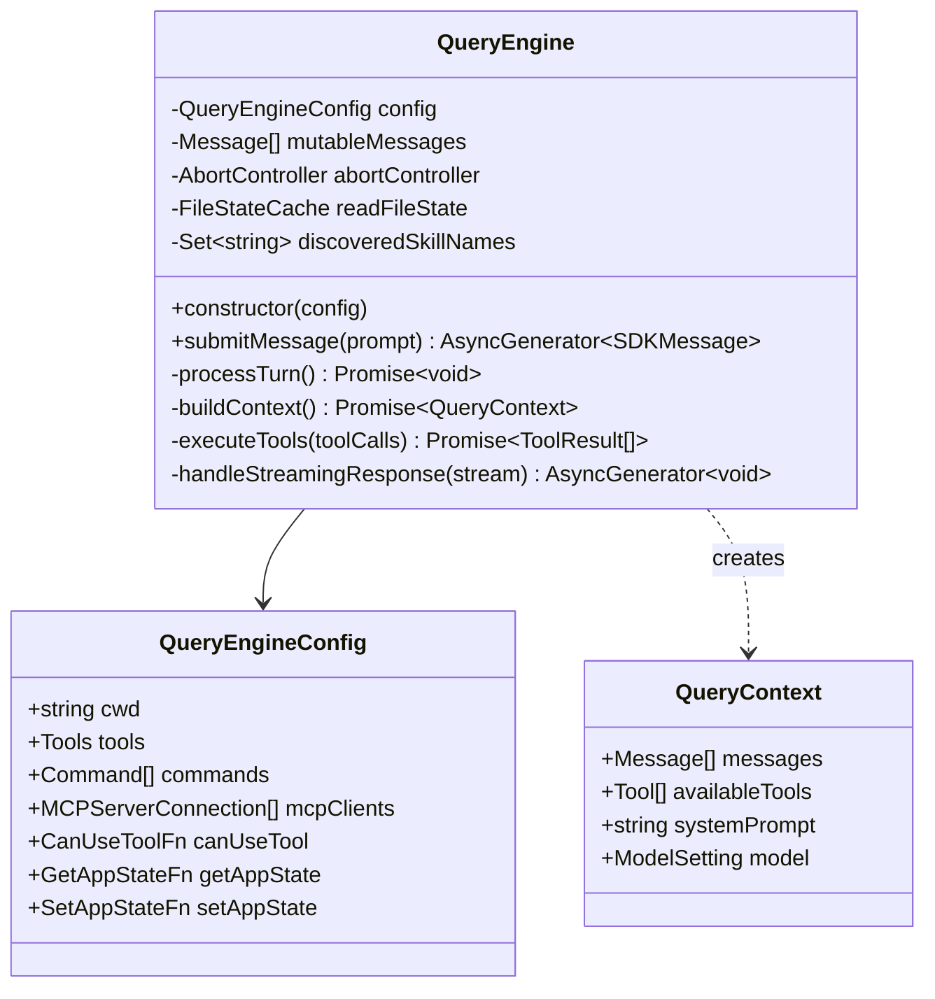

#### 主循环详解

QueryEngine 的核心是一个异步生成器（AsyncGenerator），它实现了对话的"思考-行动-观察"循环：

```typescript
// src/QueryEngine.ts (简化示意)

export class QueryEngine {
  async *submitMessage(
    prompt: string | ContentBlockParam[],
    options?: { uuid?: string; isMeta?: boolean }
  ): AsyncGenerator<SDKMessage, void, unknown> {
    // 1. 准备上下文
    const context = await this.buildContext();

    // 2. 主循环
    let turnCount = 0;
    while (turnCount < maxTurns) {
      turnCount++;

      // 3. 调用 LLM
      const stream = await anthropic.messages.create({
        model: context.model,
        messages: context.messages,
        tools: context.availableTools,
        system: context.systemPrompt,
        stream: true,
      });

      // 4. 处理流式响应
      const toolCalls: ToolCall[] = [];
      for await (const chunk of stream) {
        if (chunk.type === 'content_block_start' &&
            chunk.content_block.type === 'tool_use') {
          toolCalls.push(chunk.content_block);
        }
        yield chunk;
      }

      // 5. 如果有工具调用，执行它们
      if (toolCalls.length > 0) {
        const results = await this.executeTools(toolCalls);

        // 6. 将结果添加到上下文
        for (const result of results) {
          context.messages.push({
            role: 'user',
            content: [{
              type: 'tool_result',
              tool_use_id: result.toolUseId,
              content: result.output,
            }],
          });
        }

        // 7. 继续循环，让 AI 处理工具结果
        continue;
      }

      // 8. 没有工具调用，这轮结束
      break;
    }
  }
}
```

**流程图表示：**

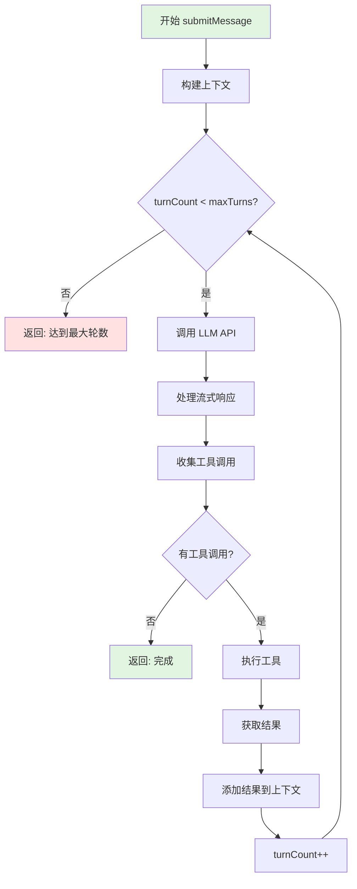

#### 上下文构建的艺术

QueryEngine 最复杂的部分之一是上下文构建。这不是简单地拼接消息，而是一个精心设计的过程：


**关键步骤详解：**

**1. 消息标准化**

```typescript
// 不同来源的消息可能有不同格式，需要统一
function normalizeMessage(message: Message): NormalizedMessage {
  return {
    role: message.role,
    content: Array.isArray(message.content)
      ? message.content
      : [{ type: 'text', text: message.content }],
    // ... 其他字段标准化
  };
}
```

**2. 上下文压缩（Context Compaction）**

当消息接近上下文限制时，Claude Code 会智能压缩：

```typescript
// src/services/compact/
interface CompactStrategy {
  name: string;
  canCompact(messages: Message[]): boolean;
  compact(messages: Message[]): CompactResult;
}

// 多种压缩策略
const strategies: CompactStrategy[] = [
  summaryStrategy,      // 使用 AI 生成摘要
  truncationStrategy,   // 截断旧消息
  snipStrategy,         // 标记可跳过部分
];
```

**3. Token 预算管理**

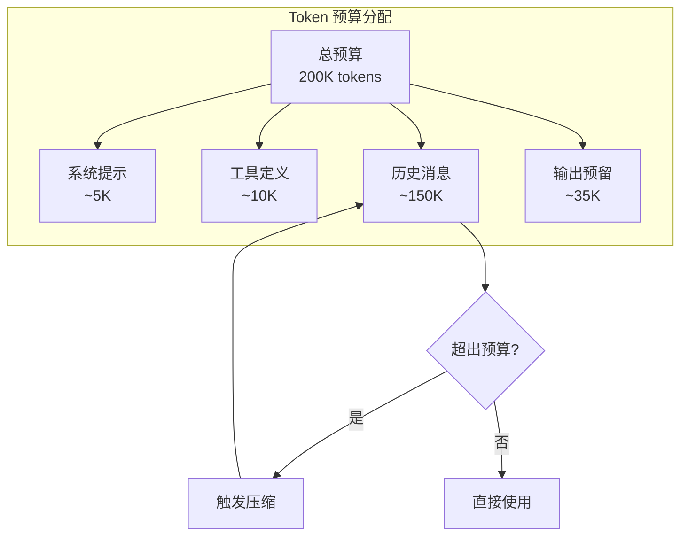

### 2.2.4 Tool 抽象层

Tool 是 Claude Code 的能力单元。所有工具都遵循统一的接口，这使得系统具有极强的可扩展性。

#### Tool 接口详解

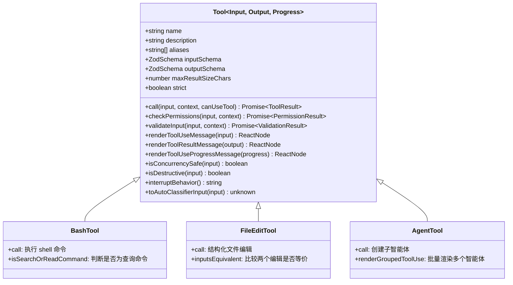

#### buildTool 工厂函数

Claude Code 使用工厂函数创建工具，提供默认值和类型安全：

```typescript
// src/Tool.ts

/**
 * 构建完整 Tool 的工厂函数
 * 填充常用方法的默认值，减少样板代码
 */
export function buildTool<D extends AnyToolDef>(def: D): BuiltTool<D> {
  const TOOL_DEFAULTS = {
    // 默认启用
    isEnabled: () => true,

    // 默认不安全并发（保守策略）
    isConcurrencySafe: () => false,

    // 默认非只读（保守策略）
    isReadOnly: () => false,

    // 默认非破坏性
    isDestructive: () => false,

    // 默认允许（权限系统会进一步检查）
    checkPermissions: async (input) => ({
      behavior: 'allow',
      updatedInput: input,
    }),

    // 默认跳过自动分类器
    toAutoClassifierInput: () => '',

    // 默认使用工具名
    userFacingName: () => def.name,
  };

  return {
    ...TOOL_DEFAULTS,
    ...def,
  } as BuiltTool<D>;
}
```

这种设计的精妙之处在于：

1. **合理的默认值**：新工具只需实现必要的方法
2. **类型安全**：TypeScript 确保所有必需字段都被实现
3. **向后兼容**：添加新方法时有默认值，不会破坏现有工具

## 2.3 模块组织哲学

### 2.3.1 垂直切片 vs 水平分层

传统项目按技术分层组织：

```
src/
  controllers/
  services/
  models/
  views/
```

Claude Code 采用**垂直切片（Vertical Slicing）**，按功能组织：

```
src/
  tools/
    BashTool/
      index.ts      # 工具逻辑
      types.ts      # 类型定义
      UI.tsx        # React 组件
      utils.ts      # 辅助函数
      test.ts       # 测试
    FileEditTool/
      ...
  commands/
    init/
    help/
    ...
  services/
    mcp/
    lsp/
    ...
```

**垂直切片的优势：**

| 优势 | 说明 |
|------|------|
| 高内聚 | 相关代码在一起，易于理解 |
| 低耦合 | 模块间依赖清晰 |
| 可独立开发 | 不同开发者可同时修改不同工具 |
| 易于测试 | 可以单独测试一个功能模块 |
| 易于删除 | 删除功能时只需删除一个目录 |

### 2.3.2 依赖注入与解耦

Claude Code 大量使用依赖注入来解耦模块：

```typescript
// 不直接导入，而是通过参数注入
interface ToolUseContext {
  options: {
    tools: Tools;
    commands: Command[];
    mainLoopModel: string;
    // ...
  };
  getAppState(): AppState;
  setAppState(f: (prev: AppState) => AppState): void;
  // ...
}

// 工具接收上下文，而非直接导入依赖
async call(input: Input, context: ToolUseContext): Promise<ToolResult> {
  const appState = context.getAppState();
  // 使用 appState...
}
```

**依赖图示例：**

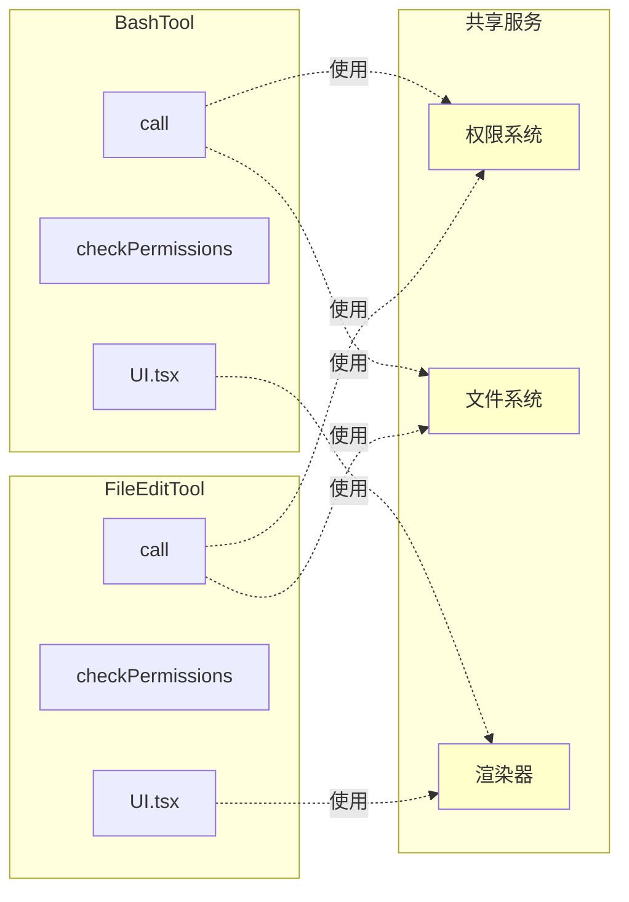

### 2.3.3 循环依赖的处理

在大型项目中，循环依赖难以避免。Claude Code 采用多种策略处理：

**1. 延迟加载（Lazy Loading）**

```typescript
// 避免在模块顶层导入
const getTeammateUtils = () => require('./utils/teammate.js');

// 在函数内部调用
function someFunction() {
  const { getTeammateId } = getTeammateUtils();
  // ...
}
```

**2. 类型提取（Type Extraction）**

将类型定义提取到独立文件，打破循环：

```typescript
// types/permissions.ts - 纯类型，无运行时依赖
export type PermissionRule = { ... };
export type PermissionDecision = { ... };

// utils/permissions/ - 实现，可以导入类型
import type { PermissionRule } from '../../types/permissions.js';
```

**3. 依赖注入**

通过参数传递依赖，而非直接导入：

```typescript
// 不好的做法 - 循环依赖
import { ToolA } from './ToolA.js'; // ToolA 导入 ToolB

// 好的做法 - 依赖注入
interface ToolRegistry {
  getTool(name: string): Tool | undefined;
}

function useTool(registry: ToolRegistry, name: string) {
  return registry.getTool(name);
}
```

## 2.4 错误处理与恢复

### 2.4.1 分层错误处理策略

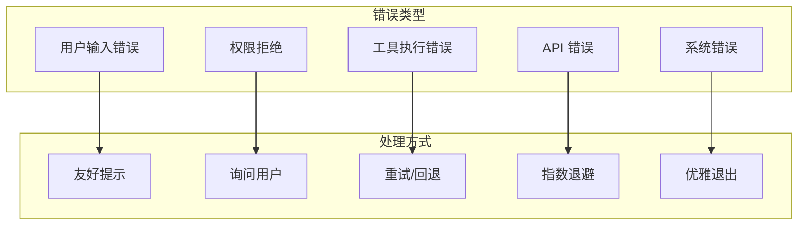

### 2.4.2 可恢复性设计

Claude Code 设计时就考虑了各种故障场景：

**1. API 失败重试**

```typescript
async function callWithRetry<T>(
  operation: () => Promise<T>,
  maxRetries: number = 3
): Promise<T> {
  for (let i = 0; i < maxRetries; i++) {
    try {
      return await operation();
    } catch (error) {
      if (i === maxRetries - 1) throw error;
      if (!isRetryableError(error)) throw error;

      // 指数退避
      await sleep(Math.pow(2, i) * 1000);
    }
  }
  throw new Error('Unreachable');
}
```

**2. 会话恢复**

```typescript
// 定期保存会话状态
async function saveSessionSnapshot(state: AppState) {
  const snapshot = {
    timestamp: Date.now(),
    messages: state.messages,
    fileCache: state.readFileState,
    // ...
  };
  await writeFile(SESSION_FILE, JSON.stringify(snapshot));
}

// 启动时检查并恢复
async function tryRestoreSession(): Promise<AppState | null> {
  try {
    const snapshot = await readFile(SESSION_FILE);
    return deserializeSession(snapshot);
  } catch {
    return null;
  }
}
```

## 2.5 本章小结

本章我们深入探讨了 Claude Code 的核心架构：

1. **分层架构**：严格的分层保证了系统的可维护性
2. **QueryEngine**：AI 对话的心脏，实现了"思考-行动-观察"循环
3. **AppState**：单一数据源，不可变状态管理
4. **Tool 抽象**：统一的能力接口，支持无限扩展
5. **垂直切片**：按功能组织代码，高内聚低耦合
6. **错误处理**：分层策略，保证系统韧性

这些架构决策共同支撑了 Claude Code 的核心价值：**让 AI 成为开发者的真正搭档**。

在下一章中，我们将深入工具系统的实现细节，看看 Claude Code 如何通过工具与外部世界交互。

---

**延伸阅读：**
- [Clean Architecture - Robert C. Martin](https://blog.cleancoder.com/uncle-bob/2012/08/13/the-clean-architecture.html)
- [Vertical Slice Architecture](https://jimmybogard.com/vertical-slice-architecture/)
- [Redux Style Guide](https://redux.js.org/style-guide/)

---

<div align="center">

**← [上一章：引言](#第1章-引言) | [下一章：工具系统详解 →](#第3章-工具系统详解)**

</div>
