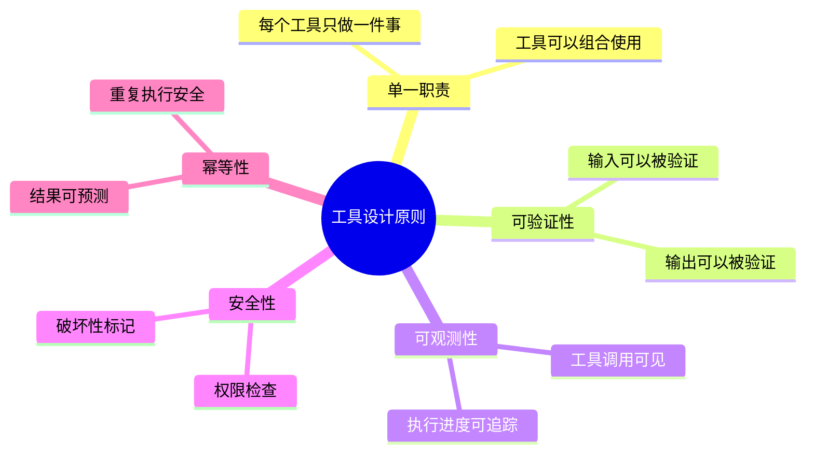
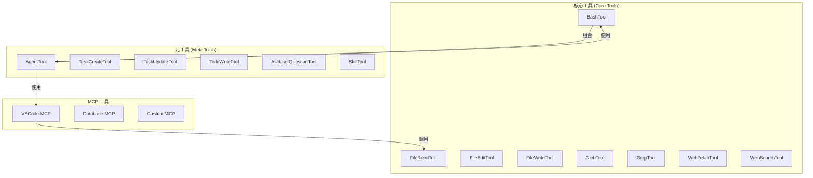
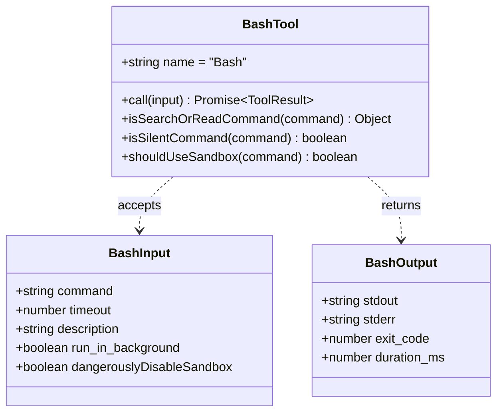
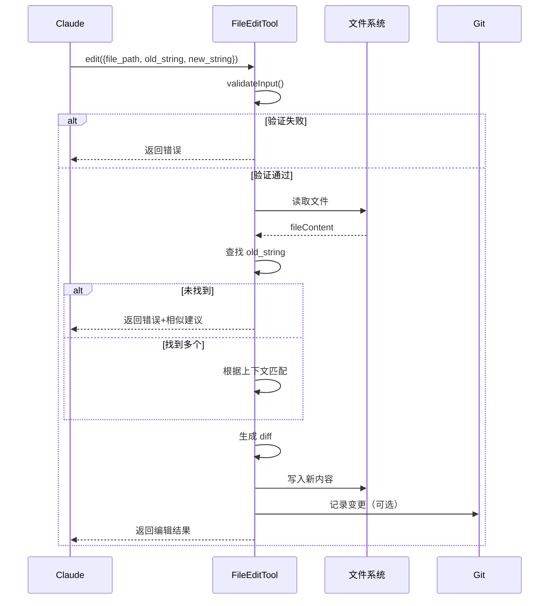
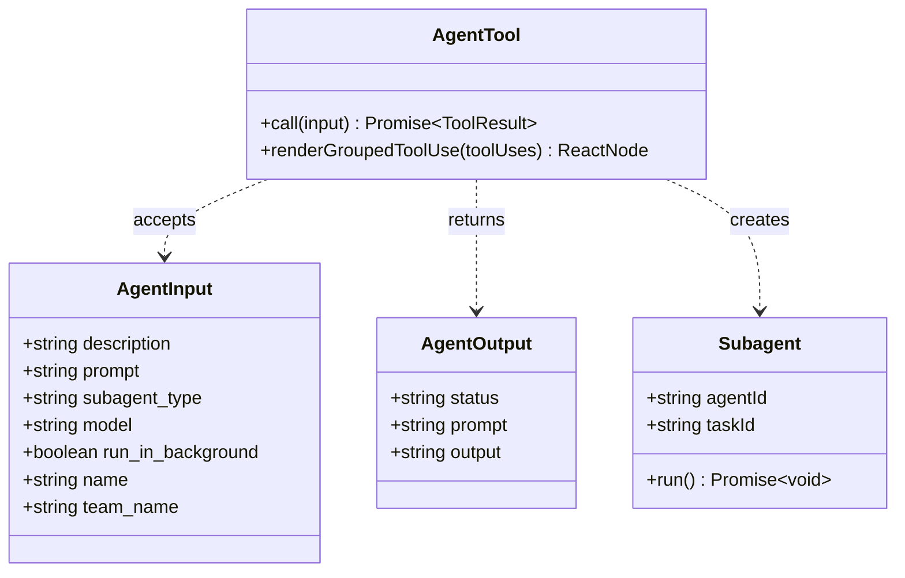
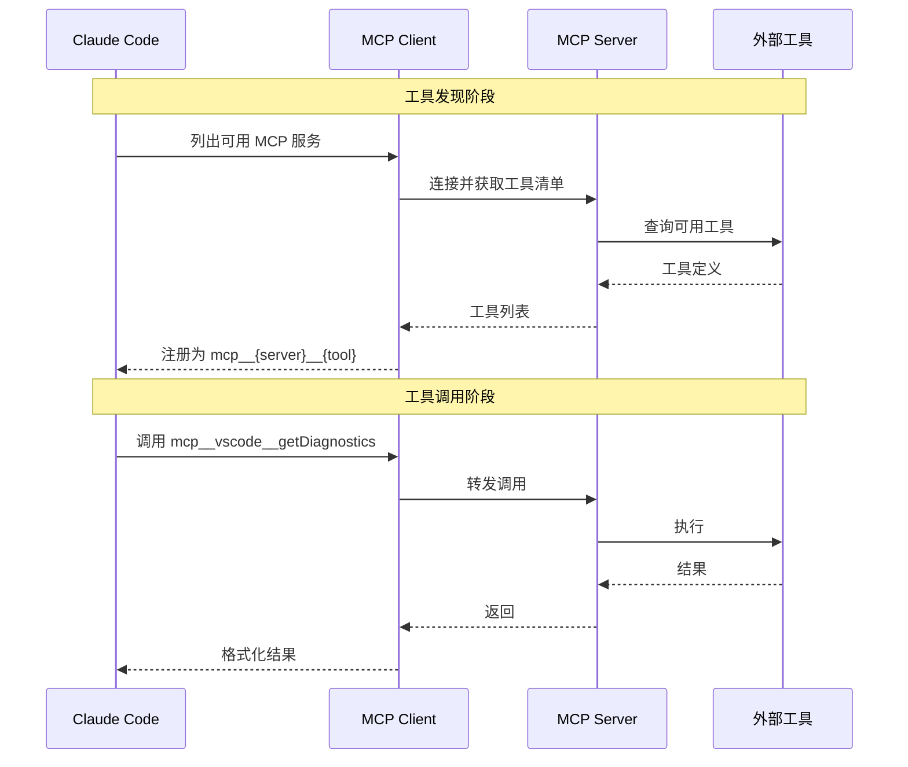
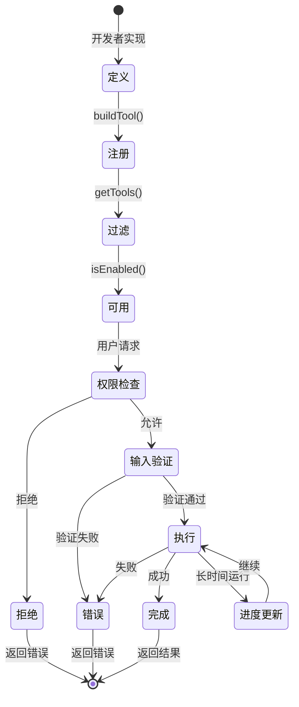
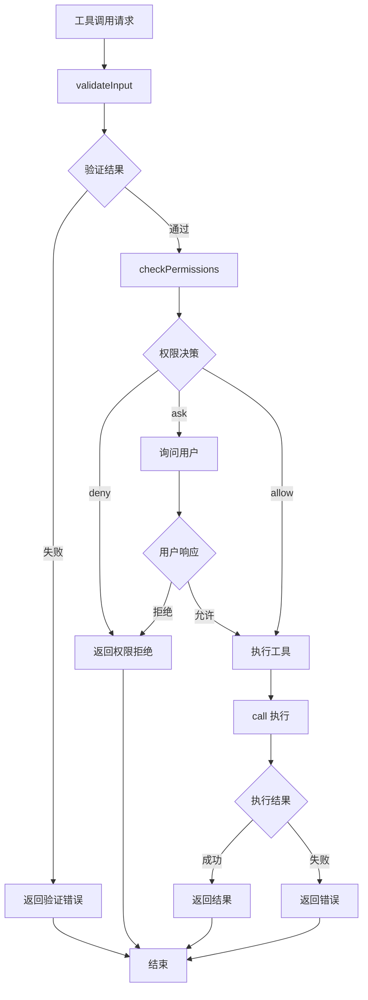

# 第3章 工具系统详解

> "工具是能力的载体，好的工具系统让能力变得可组合、可发现、可信赖。"
> —— 《Claude Code 设计哲学》

工具系统是 Claude Code 的核心能力层。如果说 QueryEngine 是"大脑"，那么工具系统就是"双手"——它让 Claude 能够真正地与外部世界交互。本章将深入探讨工具系统的设计哲学、实现细节和最佳实践。

## 3.1 工具系统的哲学

### 3.1.1 为什么工具如此重要？

在传统的 AI 对话系统中，模型的能力受限于训练数据。无论模型多么强大，它只能"谈论"事情，不能"做"事情。工具系统打破了这一限制。

**没有工具的 AI：**
```
用户："请帮我查找项目中所有未使用的 import"
AI："要查找未使用的 import，你可以使用 ESLint 的 no-unused-vars 规则，
    或者使用 depcheck 工具。你需要先安装它们..."
（用户需要手动执行这些步骤）
```

**有工具的 Claude Code：**
```
用户："请帮我查找项目中所有未使用的 import"
Claude Code：[调用 GrepTool 和 FileReadTool 分析代码]
            → [使用 BashTool 运行 ESLint]
            → "找到 12 个未使用的 import，分布在 5 个文件中：
                - src/utils/helpers.ts: lodash
                - src/components/Button.tsx: React...
                是否需要我帮你清理它们？"
```

### 3.1.2 工具的设计原则

Claude Code 的工具设计遵循以下核心原则：



## 3.2 工具分类体系

Claude Code 的工具分为三大类，每类有不同的设计考量：



### 3.2.1 核心工具（Core Tools）

核心工具是 Claude Code 与外部环境交互的基础能力。它们通常对应于开发者日常使用的命令行工具。

#### BashTool：命令执行的精髓



**BashTool 的核心设计：**

```typescript
// src/tools/BashTool/BashTool.tsx

export const BashTool = buildTool({
  name: BASH_TOOL_NAME,
  searchHint: 'execute shell commands',

  // 输入模式定义
  inputSchema: z.object({
    command: z.string()
      .describe('The command to execute'),
    timeout: z.number().optional()
      .describe(`Optional timeout in milliseconds (max ${getMaxTimeoutMs()})`),
    description: z.string().optional()
      .describe(`Clear, concise description of what this command does...`),
    run_in_background: z.boolean().optional()
      .describe('Set to true to run this command in the background'),
    dangerouslyDisableSandbox: z.boolean().optional()
      .describe('Set this to true to dangerously override sandbox mode'),
  }),

  // 核心执行逻辑
  async call(input, context, canUseTool, assistantMessage, onProgress) {
    const { command, timeout, run_in_background } = input;

    // 1. 安全检查
    if (!input.dangerouslyDisableSandbox && shouldUseSandbox(command)) {
      return { error: 'Command requires sandbox. Use dangerouslyDisableSandbox if you understand the risks.' };
    }

    // 2. 权限检查
    const permission = await canUseTool(this, input, context);
    if (permission.behavior !== 'allow') {
      return { error: 'Permission denied' };
    }

    // 3. 解析命令语义
    const { isSearch, isRead, isList } = isSearchOrReadBashCommand(command);

    // 4. 执行命令
    if (run_in_background) {
      // 后台执行
      const task = await spawnBackgroundTask(command);
      return {
        status: 'background_task_started',
        taskId: task.id,
      };
    }

    // 5. 前台执行并流式输出
    const result = await exec(command, {
      timeout,
      onProgress: (chunk) => {
        onProgress?.({
          type: 'shell_progress',
          stdout: chunk.stdout,
          stderr: chunk.stderr,
        });
      },
    });

    return {
      stdout: result.stdout,
      stderr: result.stderr,
      exit_code: result.exitCode,
      duration_ms: result.duration,
    };
  },

  // 语义分析：判断命令类型
  isSearchOrReadCommand(command: string): {
    isSearch: boolean;
    isRead: boolean;
    isList: boolean;
  } {
    // 解析命令，识别是否为查询类操作
    const parts = splitCommandWithOperators(command);

    // 搜索命令：grep, find, rg, ag, etc.
    const searchCommands = new Set(['find', 'grep', 'rg', 'ag', 'ack']);

    // 读取命令：cat, head, tail, etc.
    const readCommands = new Set(['cat', 'head', 'tail', 'less', 'more']);

    // 列表命令：ls, tree, du
    const listCommands = new Set(['ls', 'tree', 'du']);

    // 分析命令中的每个部分
    return analyzeCommandParts(parts, { searchCommands, readCommands, listCommands });
  },
});
```

**BashTool 的精妙之处：**

1. **语义感知**：不是盲目执行命令，而是理解命令的意图
2. **安全沙箱**：默认在受限环境中运行，防止意外破坏
3. **智能分类**：自动识别搜索/读取命令，优化 UI 展示
4. **后台支持**：长时间运行的命令可以放入后台

#### FileEditTool：结构化编辑的艺术

FileEditTool 是 Claude Code 最常用的工具之一，它实现了**结构化的 find-and-replace**：



**FileEditTool 的核心实现：**

```typescript
// src/tools/FileEditTool/FileEditTool.ts

export const FileEditTool = buildTool({
  name: FILE_EDIT_TOOL_NAME,
  maxResultSizeChars: 100_000,
  strict: true,

  inputSchema: z.object({
    file_path: z.string()
      .describe('The absolute path to the file'),
    old_string: z.string()
      .describe('The existing text to replace'),
    new_string: z.string()
      .describe('The new text to insert'),
    replace_all: z.boolean().optional()
      .describe('Replace all occurrences'),
  }),

  async call(input, context) {
    const { file_path, old_string, new_string, replace_all } = input;

    // 1. 安全检查
    if (old_string === new_string) {
      return { error: 'No changes to make: old_string and new_string are the same.' };
    }

    // 2. 读取文件（带编码检测）
    const fileBuffer = await fs.readFileBytes(file_path);
    const encoding = detectEncoding(fileBuffer);
    let content = fileBuffer.toString(encoding);

    // 3. 规范化换行符
    content = content.replaceAll('\r\n', '\n');

    // 4. 执行替换
    let newContent: string;
    if (replace_all) {
      newContent = content.replaceAll(old_string, new_string);
    } else {
      // 智能匹配：当 old_string 有多个匹配时，使用上下文确定位置
      const matches = findAllMatches(content, old_string);
      if (matches.length === 0) {
        // 未找到，尝试模糊匹配
        const suggestion = findSimilarString(content, old_string);
        return { error: `old_string not found. Did you mean: ${suggestion}?` };
      }
      if (matches.length === 1) {
        newContent = content.replace(old_string, new_string);
      } else {
        // 多个匹配，需要更多上下文
        return {
          error: `Multiple matches found (${matches.length}). Please provide more context.`,
          matches: matches.map(m => ({ line: m.line, preview: m.preview })),
        };
      }
    }

    // 5. 写入文件（保留原始换行符风格）
    await writeTextContent(file_path, newContent, { encoding, lineEnding: detectLineEndings(fileBuffer) });

    // 6. 返回结构化结果
    return {
      path: file_path,
      diff: generateDiff(content, newContent),
      linesChanged: countLinesChanged(content, newContent),
    };
  },

  // 检查两个编辑是否等价（用于去重）
  inputsEquivalent(a: FileEditInput, b: FileEditInput): boolean {
    return a.file_path === b.file_path &&
           a.old_string === b.old_string &&
           a.new_string === b.new_string;
  },

  // 标记为破坏性操作（影响权限系统）
  isDestructive(): boolean {
    return true; // 文件编辑总是破坏性的
  },
});
```

**FileEditTool 的设计亮点：**

| 特性 | 说明 | 好处 |
|------|------|------|
| 结构化编辑 | old_string + new_string 模式 | 精确、可验证、可回滚 |
| 编码感知 | 自动检测 UTF-8/UTF-16 | 正确处理各种文件 |
| 换行符保留 | 保留原始换行符风格 | 避免不必要的变更 |
| 智能匹配 | 上下文感知的模糊匹配 | 减少因空白字符导致的失败 |
| 破坏性标记 | 明确标记文件变更 | 权限系统可以特殊处理 |

### 3.2.2 元工具（Meta Tools）

元工具是"关于工具的工具"，它们操作 Claude Code 本身的状态和行为。

#### AgentTool：多智能体的入口



**AgentTool 的核心逻辑：**

```typescript
// src/tools/AgentTool/AgentTool.tsx

export const AgentTool = buildTool({
  name: AGENT_TOOL_NAME,
  aliases: [LEGACY_AGENT_TOOL_NAME],

  inputSchema: z.object({
    description: z.string()
      .describe('A short (3-5 word) description of the task'),
    prompt: z.string()
      .describe('The task for the agent to perform'),
    subagent_type: z.string().optional()
      .describe('The type of specialized agent to use'),
    model: z.enum(['sonnet', 'opus', 'haiku']).optional()
      .describe('Optional model override'),
    run_in_background: z.boolean().optional()
      .describe('Set to true to run this agent in the background'),
    name: z.string().optional()
      .describe('Name for the spawned agent'),
    team_name: z.string().optional()
      .describe('Team name for spawning'),
  }),

  async call(input, context) {
    const { description, prompt, subagent_type, model, run_in_background, name } = input;

    // 1. 创建子智能体上下文
    const agentId = createAgentId();
    const agentContext = createSubagentContext({
      parentContext: context,
      agentId,
      model,
    });

    // 2. 构建系统提示词
    const systemPrompt = await buildSystemPrompt({
      tools: agentContext.tools,
      subagent_type,
    });

    // 3. 启动子智能体
    if (run_in_background) {
      // 后台模式：创建异步任务
      const task = await spawnAsyncAgent({
        agentId,
        description,
        prompt,
        systemPrompt,
        context: agentContext,
      });

      return {
        status: 'async_launched',
        agentId,
        description,
        prompt,
        outputFile: task.outputPath,
      };
    }

    // 4. 同步模式：直接执行并等待结果
    const result = await runAgent({
      agentId,
      description,
      prompt,
      systemPrompt,
      context: agentContext,
      onProgress: (progress) => {
        // 转发进度到父智能体
        context.onProgress?.(progress);
      },
    });

    return {
      status: 'completed',
      prompt: result.prompt,
      output: result.output,
    };
  },

  // 批量渲染多个子智能体的 UI
  renderGroupedToolUse(toolUses, options): React.ReactNode {
    // 优化：多个子智能体并行运行时，显示为紧凑的列表
    return (
      <AgentGroupProgress
        agents={toolUses.map(t => t.agent)}
        shouldAnimate={options.shouldAnimate}
      />
    );
  },
});
```

#### TaskCreate/Update 工具：任务管理

任务工具实现了轻量级的任务追踪：

```typescript
// src/tools/TaskCreateTool/TaskCreateTool.ts

export const TaskCreateTool = buildTool({
  name: TASK_CREATE_TOOL_NAME,

  inputSchema: z.object({
    subject: z.string()
      .describe('A brief title for the task'),
    description: z.string()
      .describe('What needs to be done'),
    status: z.enum(['pending', 'in_progress', 'completed'])
      .default('pending'),
  }),

  async call(input, context) {
    const taskId = generateTaskId();
    const task: Task = {
      id: taskId,
      subject: input.subject,
      description: input.description,
      status: input.status,
      createdAt: Date.now(),
    };

    // 更新全局状态
    context.setAppState(prev => ({
      ...prev,
      tasks: {
        ...prev.tasks,
        [taskId]: task,
      },
    }));

    return {
      taskId,
      status: 'created',
      task,
    };
  },
});
```

### 3.2.3 MCP 工具

MCP (Model Context Protocol) 工具是外部系统通过标准协议接入的能力。它们在设计上与原生工具有所不同：



## 3.3 工具生命周期

一个工具从定义到执行经历完整的生命周期：



### 3.3.1 注册与发现

工具的注册发生在应用启动时：

```typescript
// src/tools.ts

export function getAllBaseTools(): Tools {
  const tools = [
    // 核心工具
    AgentTool,
    TaskOutputTool,
    BashTool,
    FileEditTool,
    FileReadTool,
    FileWriteTool,
    GlobTool,
    GrepTool,
    WebFetchTool,
    WebSearchTool,

    // 条件编译的工具
    ...(feature('AGENT_TRIGGERS') ? cronTools : []),
    ...(feature('KAIROS') ? [SendUserFileTool] : []),

    // 延迟加载的工具
    getPowerShellTool(),

    // ... 更多工具
  ].filter(Boolean); // 过滤掉 null/undefined

  return tools.map(tool => {
    // 应用工具权限过滤
    if (shouldFilterTool(tool)) {
      return { ...tool, isEnabled: () => false };
    }
    return tool;
  });
}
```

### 3.3.2 权限检查流程



## 3.4 工具开发最佳实践

### 3.4.1 工具实现模板

```typescript
// 1. 定义输入输出类型
// types.ts
import { z } from 'zod/v4';

export const inputSchema = z.object({
  // 定义你的输入字段
  param1: z.string().describe('参数1的描述'),
  param2: z.number().optional().describe('可选参数'),
});

export const outputSchema = z.object({
  // 定义输出字段
  result: z.string(),
  metadata: z.object({
    duration: z.number(),
  }),
});

export type MyToolInput = z.infer<typeof inputSchema>;
export type MyToolOutput = z.infer<typeof outputSchema>;

// 2. 实现工具逻辑
// index.ts
import { buildTool } from '../../Tool.js';
import { inputSchema, outputSchema, type MyToolInput, type MyToolOutput } from './types.js';

export const MyTool = buildTool({
  name: 'MyTool',
  description: '工具的简短描述',

  inputSchema,
  outputSchema,

  // 权限检查
  async checkPermissions(input, context) {
    // 实现权限检查逻辑
    return { behavior: 'allow', updatedInput: input };
  },

  // 输入验证
  async validateInput(input, context) {
    // 实现额外的验证逻辑
    if (input.param1.length === 0) {
      return {
        result: false,
        message: 'param1 cannot be empty',
      };
    }
    return { result: true };
  },

  // 核心执行
  async call(input, context, canUseTool, assistantMessage, onProgress) {
    const startTime = Date.now();

    // 执行工具逻辑
    const result = await doSomething(input);

    // 报告进度（如果长时间运行）
    onProgress?.({
      type: 'my_tool_progress',
      percent: 50,
    });

    return {
      result: result.data,
      metadata: {
        duration: Date.now() - startTime,
      },
    };
  },

  // UI 渲染（可选但推荐）
  renderToolUseMessage(input) {
    return <MyToolUseView input={input} />;
  },

  renderToolResultMessage(output) {
    return <MyToolResultView output={output} />;
  },
});
```

### 3.4.2 测试策略

```typescript
// MyTool.test.ts
import { describe, it, expect, vi } from 'vitest';
import { MyTool } from './index.js';

describe('MyTool', () => {
  it('should validate input correctly', async () => {
    const result = await MyTool.validateInput(
      { param1: '', param2: 42 },
      mockContext
    );
    expect(result.result).toBe(false);
    expect(result.message).toContain('cannot be empty');
  });

  it('should execute successfully', async () => {
    const mockCanUseTool = vi.fn().mockResolvedValue({ behavior: 'allow' });

    const result = await MyTool.call(
      { param1: 'test', param2: 42 },
      mockContext,
      mockCanUseTool
    );

    expect(result.result).toBeDefined();
    expect(result.metadata.duration).toBeGreaterThan(0);
  });

  it('should report progress for long operations', async () => {
    const onProgress = vi.fn();

    await MyTool.call(
      { param1: 'test' },
      mockContext,
      mockCanUseTool,
      undefined,
      onProgress
    );

    expect(onProgress).toHaveBeenCalled();
  });
});
```

## 3.5 本章小结

本章深入探讨了 Claude Code 的工具系统：

1. **工具哲学**：工具让 AI 从"谈论"到"做事"
2. **三大类别**：核心工具、元工具、MCP 工具各有侧重
3. **生命周期**：从注册到执行，每个环节精心设计
4. **开发实践**：标准化的实现模式和测试策略

工具系统是 Claude Code 的"能力层"，它让 AI 能够真正与外部世界交互。在下一章中，我们将探讨如何安全地管理这些能力——权限系统。

---

**延伸阅读：**
- [Anthropic Tool Use Guide](https://docs.anthropic.com/en/docs/build-with-claude/tool-use)
- [Model Context Protocol Spec](https://modelcontextprotocol.io/)
- [Building CLI Tools with Node.js](https://nodejs.org/api/cli.html)

---

<div align="center">

**← [上一章：核心架构](#第2章-核心架构) | [下一章：权限系统深度解析 →](#第4章-权限系统)**

</div>
