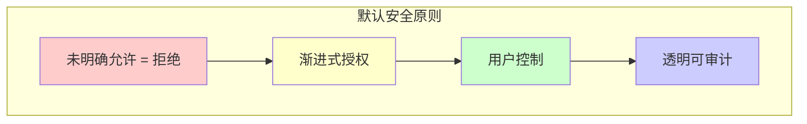
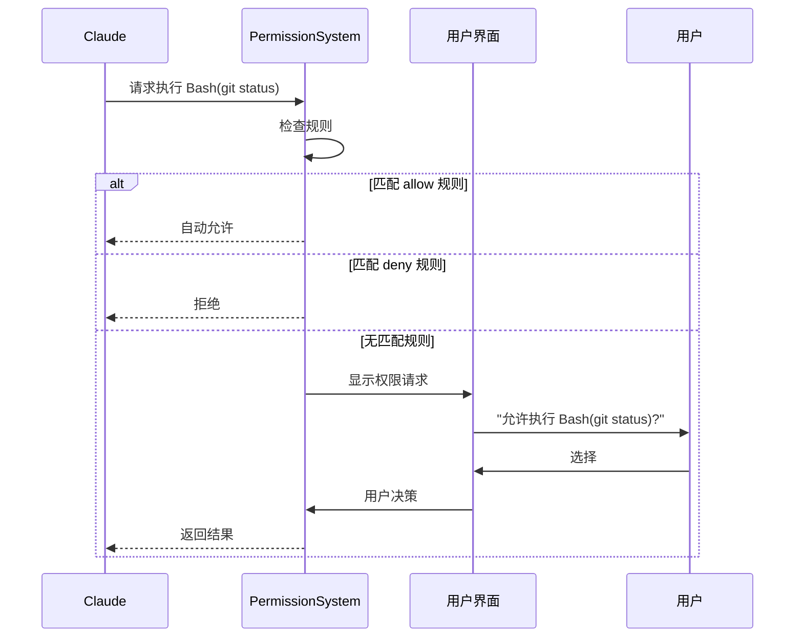
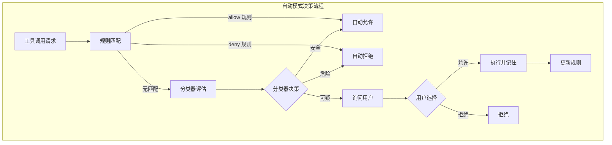
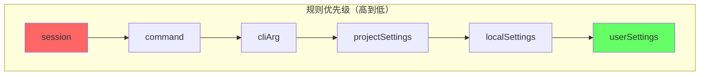
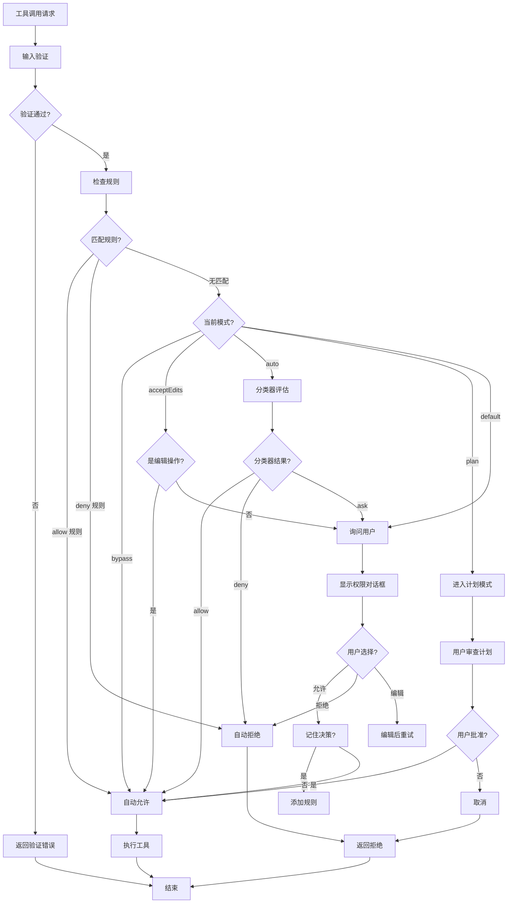
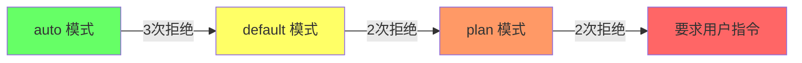

# 第4章 权限系统深度解析

> "安全不是阻碍，而是信任的基石。"
> —— 《Claude Code 设计哲学》

权限系统是 Claude Code 的安全基石。它让用户能够在享受 AI 强大能力的同时，保持对系统的完全控制。本章将深入探讨权限系统的设计理念、实现机制和实践应用。

## 4.1 权限哲学

### 4.1.1 默认安全原则

Claude Code 的权限系统建立在"默认安全"原则之上：



**对比传统权限模型：**

| 模型 | 默认行为 | 授权方式 | 适用场景 |
|------|---------|---------|---------|
| **黑名单模型** | 全部允许，拒绝特定项 | 列出禁止项 | 开放环境 |
| **白名单模型** | 全部拒绝，允许特定项 | 列出允许项 | 安全环境 |
| **Claude Code 模型** | 交互式确认 | 规则+分类器+用户确认 | AI 助手 |

### 4.1.2 渐进式信任

渐进式信任是 Claude Code 权限系统的核心设计思想：


**信任级别的实际体现：**

| 级别 | 权限模式 | 自动允许 | 需要确认 | 完全拒绝 |
|------|---------|---------|---------|---------|
| 0 | `default` | 无 | 所有操作 | 无 |
| 1 | `default` + 规则 | `FileRead *.md` | 其他 | 危险命令 |
| 2 | `plan` | 无 | 所有操作（带计划） | 危险命令 |
| 3 | `auto` | 安全操作 | 可疑操作 | 危险命令 |
| 4 | `acceptEdits` | 所有编辑 | 破坏性操作 | 危险命令 |
| 5 | `bypass` | 所有操作 | 无 | 无 |

## 4.2 权限模式详解

### 4.2.1 权限模式全景

```typescript
// src/types/permissions.ts

export type PermissionMode =
  | 'default'      // 标准模式，每次询问
  | 'auto'       // 自动模式，AI 判断安全则允许
  | 'plan'       // 计划模式，先展示再执行
  | 'bypass'     // 绕过模式（危险）
  | 'acceptEdits' // 自动接受编辑
  | 'dontAsk'     // 静默执行

export const INTERNAL_PERMISSION_MODES = [
  ...EXTERNAL_PERMISSION_MODES,
  ...(feature('TRANSCRIPT_CLASSIFIER') ? (['auto'] as const) : ([] as const)),
] as const satisfies readonly PermissionMode[]
```

### 4.2.2 default 模式

`default` 模式是 Claude Code 的默认权限模式，也是最适合新用户的模式。

**工作流程：**



**配置示例：**

```json
// ~/.claude/settings.json
{
  "permissions": {
    "mode": "default",
    "alwaysAllow": [
      { "tool": "Bash", "pattern": "git status" },
      { "tool": "Bash", "pattern": "git diff" },
      { "tool": "FileRead", "pattern": "*.md" }
    ],
    "alwaysDeny": [
      { "tool": "Bash", "pattern": "rm -rf /" }
    ]
  }
}
```

### 4.2.3 auto 模式与分类器

`auto` 模式是 Claude Code 最智能的权限模式。它使用 AI 分类器来判断操作是否安全。

**分类器架构：**



**分类器实现：**

```typescript
// src/utils/permissions/yoloClassifier.ts

interface ClassifierInput {
  toolName: string;
  toolInput: unknown;
  command?: string;
  descriptions: string[];
  cwd: string;
}

interface ClassifierOutput {
  decision: 'allow' | 'ask' | 'deny';
  confidence: number;
  reason: string;
}

async function classifyYoloAction(
  input: ClassifierInput,
  context: ToolUseContext
): Promise<ClassifierOutput> {
  // 构建分类器提示词
  const prompt = buildClassifierPrompt(input);

  // 调用轻量级模型进行分类
  const response = await anthropic.messages.create({
    model: 'claude-3-haiku-20240307',
    messages: [{ role: 'user', content: prompt }],
    max_tokens: 150,
  });

  // 解析分类结果
  return parseClassifierResponse(response);
}

// 分类器提示词示例
function buildClassifierPrompt(input: ClassifierInput): string {
  return `
You are a security classifier for an AI coding assistant.
Analyze the following tool use and classify it as SAFE, SUSPICIOUS, or DANGEROUS.

Tool: ${input.toolName}
Input: ${JSON.stringify(input.toolInput)}
Working Directory: ${input.cwd}

Consider:
1. Does this modify system files?
2. Does this access sensitive data?
3. Does this execute arbitrary code?
4. Is this a standard development operation?

Respond with JSON:
{
  "decision": "allow|ask|deny",
  "confidence": 0-1,
  "reason": "brief explanation"
}
`;
}
```

**分类器的优势：**

| 优势 | 说明 |
|------|------|
| 智能判断 | 理解操作语义，不只是模式匹配 |
| 上下文感知 | 考虑工作目录、项目类型等 |
| 学习适应 | 根据用户反馈改进 |
| 轻量快速 | 使用轻量级模型，延迟 < 100ms |

### 4.2.4 plan 模式

`plan` 模式要求 AI 在执行前制定详细计划，用户可以审查后再执行。

**工作流程：**

```mermaid
sequenceDiagram
    participant User as 用户
    participant AI as Claude
    participant PM as Plan Mode

    User->>AI: "重构这个模块"
    AI->>PM: 进入计划模式

    PM->>AI: 生成计划
    AI->>PM: 返回计划

    PM->>User: 显示计划
    Note over PM: 1. 读取文件 src/*.ts
              2. 分析依赖关系
              3. 重命名函数
              4. 更新导入
              5. 运行测试

    User->>PM: 批准/修改/取消

    alt 批准
        PM->>AI: 执行计划
        AI->>PM: 执行每一步
        PM->>User: 显示进度
    else 修改
        User->>PM: 编辑计划
        PM->>User: 显示更新后的计划
    else 取消
        PM->>User: 退出计划模式
    end
```

**计划模式的价值：**

1. **透明性**：用户清楚知道 AI 要做什么
2. **可控性**：可以修改或跳过某些步骤
3. **学习性**：用户可以从中学到重构策略
4. **安全性**：破坏性操作必须显式批准

## 4.3 规则系统

### 4.3.1 规则结构

```typescript
// src/types/permissions.ts

export type PermissionRule = {
  source: PermissionRuleSource  // 规则来源
  ruleBehavior: PermissionBehavior  // allow | deny | ask
  ruleValue: PermissionRuleValue    // 规则内容
}

export type PermissionRuleSource =
  | 'userSettings'    // ~/.claude/settings.json
  | 'projectSettings' // .claude/settings.json
  | 'localSettings'   // 本地配置
  | 'cliArg'          // 命令行参数
  | 'command'         // 会话中动态添加
  | 'session'         // 会话级别

export type PermissionRuleValue = {
  toolName: string      // 工具名
  ruleContent?: string  // 可选的模式
}
```

### 4.3.2 规则优先级

当多个规则冲突时，Claude Code 使用优先级系统：



**示例场景：**

```json
// ~/.claude/settings.json (userSettings)
{
  "permissions": {
    "alwaysAllow": [
      { "tool": "Bash", "pattern": "npm install" }
    ]
  }
}

// .claude/settings.json (projectSettings)
{
  "permissions": {
    "alwaysDeny": [
      { "tool": "Bash", "pattern": "npm install" }
    ]
  }
}
```

**结果：** `npm install` 被拒绝，因为 `projectSettings` 优先级更高。

### 4.3.3 规则匹配算法

```typescript
// src/utils/permissions/permissions.ts

function matchingRuleForInput(
  input: string,
  context: ToolPermissionContext,
  toolName: string,
  behavior: PermissionBehavior
): PermissionRule | null {
  // 按优先级顺序检查规则来源
  const sources: PermissionRuleSource[] = [
    'session', 'command', 'cliArg',
    'policySettings', 'projectSettings',
    'localSettings', 'userSettings'
  ];

  for (const source of sources) {
    const rules = context[`always${capitalize(behavior)}Rules`][source];
    if (!rules) continue;

    for (const ruleString of rules) {
      const rule = parseRule(ruleString);
      if (rule.toolName !== toolName) continue;

      // 检查内容模式匹配
      if (rule.ruleContent) {
        if (matchWildcardPattern(rule.ruleContent, input)) {
          return { source, ruleBehavior: behavior, ruleValue: rule };
        }
      } else {
        // 无内容规则匹配整个工具
        return { source, ruleBehavior: behavior, ruleValue: rule };
      }
    }
  }

  return null;
}

// 通配符匹配支持 * 和 ?
function matchWildcardPattern(pattern: string, input: string): boolean {
  const regex = new RegExp(
    '^' + pattern.replace(/\*/g, '.*').replace(/\?/g, '.') + '$'
  );
  return regex.test(input);
}
```

## 4.4 权限决策流程

### 4.4.1 完整决策流程图



### 4.4.2 权限上下文

```typescript
// src/Tool.ts

export interface ToolPermissionContext {
  mode: PermissionMode

  // 按来源组织的规则
  alwaysAllowRules: PermissionRulesBySource
  alwaysDenyRules: PermissionRulesBySource
  alwaysAskRules: PermissionRulesBySource

  // 额外工作目录
  additionalWorkingDirectories: Map<string, AdditionalWorkingDirectory>

  // 是否可用绕过模式
  isBypassPermissionsModeAvailable: boolean
}

// 权限上下文随会话状态变化
export interface ToolUseContext {
  options: {
    tools: Tools
    commands: Command[]
    mainLoopModel: string
    // ...
  }

  getAppState(): AppState
  setAppState(f: (prev: AppState) => AppState): void

  // 工具权限上下文
  toolPermissionContext: ToolPermissionContext

  // 其他上下文...
}
```

## 4.5 拒绝追踪与防护

### 4.5.1 连续拒绝防护

Claude Code 实现了连续拒绝追踪机制，防止 AI 在权限被拒绝后反复尝试相同操作。

```typescript
// src/utils/permissions/denialTracking.ts

interface DenialTrackingState {
  // 最近拒绝的工具调用
  recentDenials: Array<{
    toolName: string
    input: unknown
    timestamp: number
  }>

  // 连续拒绝计数
  consecutiveDenialCount: number

  // 最后一次拒绝时间
  lastDenialTime: number
}

const DENIAL_LIMITS = {
  // 连续拒绝阈值
  MAX_CONSECUTIVE_DENIALS: 3,

  // 拒绝冷却时间（毫秒）
  DENIAL_COOLDOWN_MS: 5000,

  // 最大拒绝历史
  MAX_DENIAL_HISTORY: 10,
}

function shouldFallbackToPrompting(
  state: DenialTrackingState,
  toolName: string,
  input: unknown
): boolean {
  // 检查是否超过连续拒绝阈值
  if (state.consecutiveDenialCount >= DENIAL_LIMITS.MAX_CONSECUTIVE_DENIALS) {
    return true
  }

  // 检查是否在冷却期内
  const timeSinceLastDenial = Date.now() - state.lastDenialTime
  if (timeSinceLastDenial < DENIAL_LIMITS.DENIAL_COOLDOWN_MS) {
    return true
  }

  // 检查是否是重复拒绝
  const isDuplicate = state.recentDenials.some(
    d => d.toolName === toolName && isEqual(d.input, input)
  )
  if (isDuplicate) {
    return true
  }

  return false
}
```

### 4.5.2 降级策略

当检测到连续拒绝时，系统会降级到更保守的策略：



## 4.6 本章小结

本章深入探讨了 Claude Code 的权限系统：

1. **默认安全原则**：未明确允许即拒绝
2. **渐进式信任**：从 default 到 bypass 的多级权限模式
3. **智能分类器**：auto 模式使用 AI 判断操作安全性
4. **灵活的规则系统**：支持通配符、多来源、优先级
5. **连续拒绝防护**：防止反复尝试相同操作

权限系统让 Claude Code 在强大与安全之间取得了平衡。用户可以根据自己的信任程度选择合适的权限模式，既能享受 AI 的便利，又能保持对系统的控制。

在下一章中，我们将探讨 Claude Code 如何管理复杂的应用状态——状态管理系统。

---

**延伸阅读：**
- [Principle of Least Privilege](https://en.wikipedia.org/wiki/Principle_of_least_privilege)
- [OAuth 2.0 Authorization Framework](https://tools.ietf.org/html/rfc6749)
- [RBAC vs ABAC](https://www.dnsstuff.com/rbac-vs-abac-access-control)

---

<div align="center">

**← [上一章：工具系统](#第3章-工具系统) | [下一章：状态管理 →](#第5章-状态管理)**

</div>
