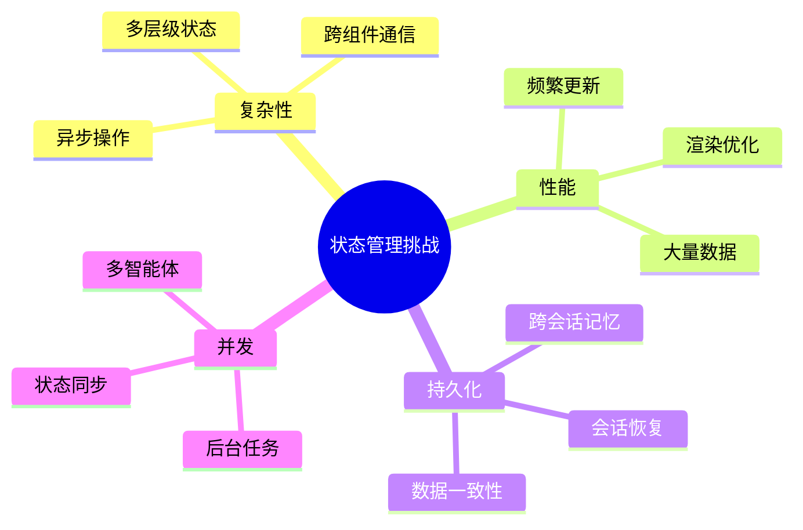
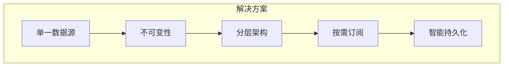
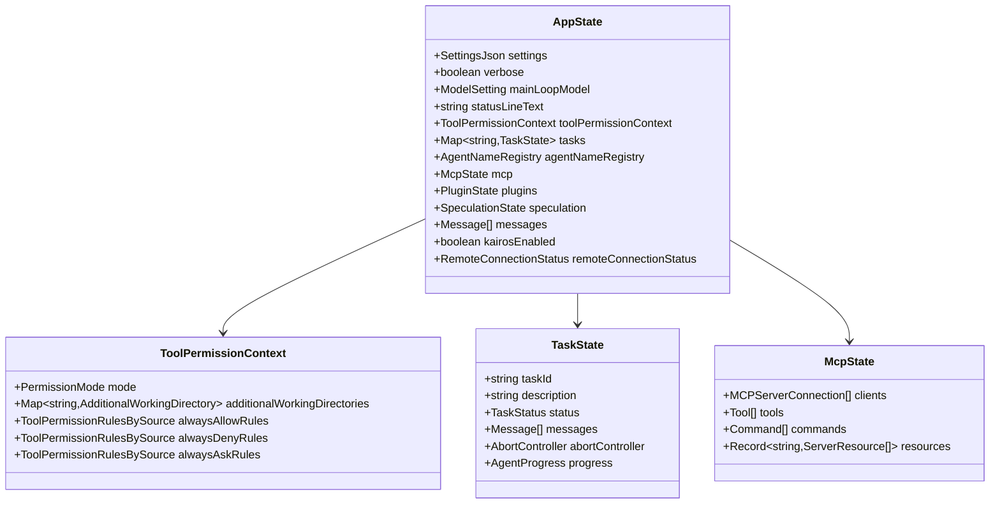
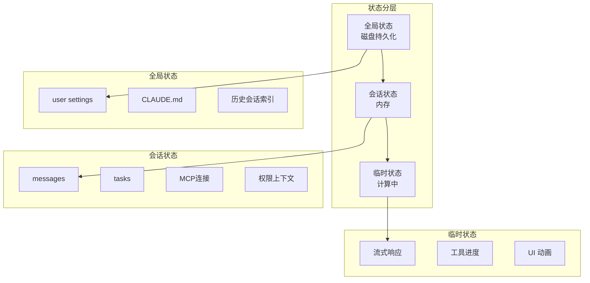
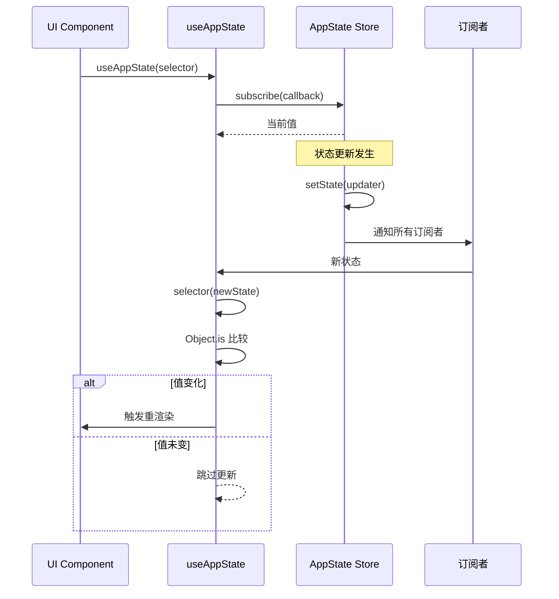

# 第5章 状态管理与响应式架构

> "状态是应用的血液，良好的状态管理让系统流动起来。"
> —— 《Claude Code 设计哲学》

Claude Code 需要管理极其复杂的状态：对话历史、工具执行状态、用户偏好、MCP 连接、权限上下文、多智能体状态等。本章将深入探讨其状态管理的架构设计、实现机制和最佳实践。

## 5.1 状态管理的挑战

### 5.1.1 为什么状态管理困难？

传统应用的状态管理相对简单，但 Claude Code 面临特殊挑战：



**具体挑战：**

| 挑战 | 描述 | 影响 |
|------|------|------|
| **状态规模** | 长对话可能有数千条消息 | 内存占用、渲染性能 |
| **更新频率** | 流式响应每秒多次更新 | 渲染优化、状态合并 |
| **异步操作** | 工具执行、MCP 调用都是异步 | 竞态条件、状态一致性 |
| **多智能体** | 子智能体有自己的状态 | 状态隔离、通信机制 |

### 5.1.2 Claude Code 的解决方案



## 5.2 核心架构

### 5.2.1 AppState 全景

AppState 是 Claude Code 的单一数据源，包含所有应用状态：



**核心状态字段详解：**

```typescript
// src/state/AppStateStore.ts

export type AppState = DeepImmutable<{
  // === 基础设置 ===
  settings: SettingsJson           // 用户设置
  verbose: boolean                 // 详细模式
  mainLoopModel: ModelSetting      // 当前模型

  // === UI 状态 ===
  statusLineText: string | undefined
  expandedView: 'none' | 'tasks' | 'teammates'
  isBriefOnly: boolean

  // === 权限状态 ===
  toolPermissionContext: ToolPermissionContext

  // === 任务状态 ===
  // Unified task state - excluded from DeepImmutable
  tasks: { [taskId: string]: TaskState }
  foregroundedTaskId?: string
  viewingAgentTaskId?: string

  // === MCP 状态 ===
  mcp: {
    clients: MCPServerConnection[]
    tools: Tool[]
    commands: Command[]
    resources: Record<string, ServerResource[]>
    pluginReconnectKey: number
  }

  // === 插件状态 ===
  plugins: {
    enabled: LoadedPlugin[]
    disabled: LoadedPlugin[]
    commands: Command[]
    errors: PluginError[]
  }

  // === 推测执行状态 ===
  speculation: SpeculationState

  // === 远程连接状态 ===
  remoteSessionUrl: string | undefined
  remoteConnectionStatus: 'connecting' | 'connected' | 'reconnecting' | 'disconnected'
  remoteBackgroundTaskCount: number

  // ... 更多字段
}>
```

### 5.2.2 不可变性的价值

Claude Code 使用 TypeScript 的类型系统强制不可变性：

```typescript
// src/types/utils.ts

// DeepImmutable 递归地将所有属性设为只读
type DeepImmutable<T> = {
  readonly [K in keyof T]: T[K] extends object
    ? T[K] extends Function
      ? T[K]
      : DeepImmutable<T[K]>
    : T[K]
}

// 使用示例
interface User {
  name: string
  address: {
    city: string
  }
}

type ImmutableUser = DeepImmutable<User>
// 等价于：
// {
//   readonly name: string
//   readonly address: {
//     readonly city: string
//   }
// }
```

**不可变性的好处：**

| 好处 | 说明 |
|------|------|
| **可预测性** | 状态只能通过 `setState` 更新 |
| **比较优化** | 引用相等即可判断状态变化 |
| **时间旅行调试** | 容易实现撤销/重做 |
| **并发安全** | 状态不会被意外修改 |

## 5.3 Store 实现

### 5.3.1 极简 Store 设计

Claude Code 没有使用 Redux 或 MobX，而是实现了极简的 Store：

```typescript
// src/state/store.ts

export interface Store<T> {
  /** 获取当前状态 */
  getState(): T

  /** 更新状态（函数式更新） */
  setState(updater: (prev: T) => T): void

  /** 订阅状态变化 */
  subscribe(callback: (newState: T, oldState: T) => void): () => void
}

export function createStore<T>(
  initialState: T,
  onChange?: (args: { newState: T; oldState: T }) => void
): Store<T> {
  let state = initialState
  const listeners = new Set<(newState: T, oldState: T) => void>()

  return {
    getState: () => state,

    setState: (updater) => {
      const oldState = state
      state = updater(state)

      // 调用全局 onChange 回调
      onChange?.({ newState: state, oldState })

      // 通知所有订阅者
      listeners.forEach(listener => listener(state, oldState))
    },

    subscribe: (callback) => {
      listeners.add(callback)
      // 返回取消订阅函数
      return () => listeners.delete(callback)
    },
  }
}
```

**与 Redux 对比：**

| 特性 | Redux | Claude Code Store |
|------|-------|-------------------|
| Actions | 必需 | 无（直接函数更新）|
| Reducers | 必需 | 无（内联更新函数）|
| Middleware | 支持 | 通过 onChange 回调 |
| DevTools | 丰富 | 基础日志 |
| Bundle Size | ~10KB | ~100B |

### 5.3.2 React 集成

使用 React 18 的 `useSyncExternalStore` 实现高效订阅：

```typescript
// src/state/AppState.tsx

const AppStoreContext = React.createContext<AppStateStore | null>(null)

export function useAppState<T>(
  selector: (state: AppState) => T
): T {
  const store = useContext(AppStoreContext)
  if (!store) {
    throw new Error('useAppState must be used within AppStateProvider')
  }

  // 使用 useCallback 缓存 selector 包装器
  const get = useCallback(() => {
    return selector(store.getState())
  }, [selector, store])

  // useSyncExternalStore 自动处理订阅和快照
  return useSyncExternalStore(
    store.subscribe,
    get,
    get  // server snapshot (same for SSR)
  )
}
```

**性能优化的关键：**

```typescript
// ✅ 好的做法：选择原始值
const verbose = useAppState(s => s.verbose)

// ✅ 好的做法：选择稳定引用
const { text, promptId } = useAppState(s => s.promptSuggestion)

// ❌ 坏的做法：每次都创建新对象
const settings = useAppState(s => ({ ...s.settings }))
```

## 5.4 状态分层

### 5.4.1 三层状态架构



**各层特性：**

| 层级 | 存储 | 生命周期 | 恢复策略 |
|------|------|---------|---------|
| 全局状态 | 磁盘 | 永久 | 启动加载 |
| 会话状态 | 内存+磁盘 | 会话期间 | 崩溃恢复 |
| 临时状态 | 内存 | 短暂 | 无需恢复 |

### 5.4.2 状态选择器模式

```typescript
// 基础选择器
export const selectSettings = (state: AppState) => state.settings
export const selectMessages = (state: AppState) => state.messages
export const selectTasks = (state: AppState) => state.tasks

// 派生选择器
export const selectTaskById = (taskId: string) =>
  (state: AppState) => state.tasks[taskId]

export const selectActiveTasks = (state: AppState) =>
  Object.values(state.tasks).filter(t => t.status === 'running')

export const selectMcpTools = (state: AppState) =>
  state.mcp.tools

// 使用选择器
function TaskList() {
  const tasks = useAppState(selectActiveTasks)
  // 只在 active tasks 变化时重渲染
  return <TaskListUI tasks={tasks} />
}
```

## 5.5 状态持久化

### 5.5.1 会话保存与恢复

```typescript
// src/utils/sessionStorage.ts

interface SessionSnapshot {
  version: number
  timestamp: number
  sessionId: string
  messages: Message[]
  tasks: TaskState[]
  fileStateCache: FileStateCache
  usage: Usage
}

export async function saveSessionSnapshot(
  state: AppState
): Promise<void> {
  const snapshot: SessionSnapshot = {
    version: SESSION_VERSION,
    timestamp: Date.now(),
    sessionId: getSessionId(),
    messages: state.messages,
    tasks: Object.values(state.tasks),
    fileStateCache: state.readFileState,
    usage: getTotalUsage(),
  }

  await writeFile(
    getSessionFilePath(),
    JSON.stringify(snapshot)
  )
}

export async function loadSessionSnapshot(
  sessionId: string
): Promise<SessionSnapshot | null> {
  try {
    const data = await readFile(getSessionFilePath(sessionId))
    const snapshot: SessionSnapshot = JSON.parse(data)

    // 版本兼容性检查
    if (snapshot.version !== SESSION_VERSION) {
      return migrateSnapshot(snapshot)
    }

    return snapshot
  } catch {
    return null
  }
}
```

### 5.5.2 自动保存策略

```typescript
// 防抖保存（避免频繁写入）
const debouncedSave = debounce(saveSessionSnapshot, 5000)

// 关键事件触发保存
onChangeAppState((newState, oldState) => {
  // 消息变化时保存
  if (newState.messages.length !== oldState.messages.length) {
    debouncedSave(newState)
  }

  // 任务状态变化时立即保存
  if (hasTaskStatusChanged(newState.tasks, oldState.tasks)) {
    saveSessionSnapshot(newState)
  }
})
```

## 5.6 响应式更新

### 5.6.1 更新流程



### 5.6.2 批量更新

```typescript
// 批量更新多个字段
setAppState(prev => ({
  ...prev,
  messages: [...prev.messages, newMessage],
  tasks: {
    ...prev.tasks,
    [taskId]: updatedTask
  }
}))

// 或使用 immer 风格（实际使用展开操作符）
setAppState(prev => produce(prev, draft => {
  draft.messages.push(newMessage)
  draft.tasks[taskId].status = 'completed'
}))
```

## 5.7 本章小结

本章深入探讨了 Claude Code 的状态管理：

1. **挑战**：复杂状态、高频更新、异步操作、多智能体
2. **单一数据源**：AppState 包含所有状态
3. **不可变性**：DeepImmutable 类型确保状态安全
4. **极简 Store**：自定义 Store，无 Redux 开销
5. **分层架构**：全局/会话/临时三层状态
6. **持久化**：自动保存和会话恢复
7. **响应式**：useSyncExternalStore 实现高效订阅

状态管理是 Claude Code 的"隐形骨架"，支撑着复杂功能的实现。在下一章中，我们将探讨多智能体架构。

---

<div align="center">

**← [上一章：权限系统](#第4章-权限系统) | [下一章：多智能体 →](#第6章-多智能体)**

</div>
