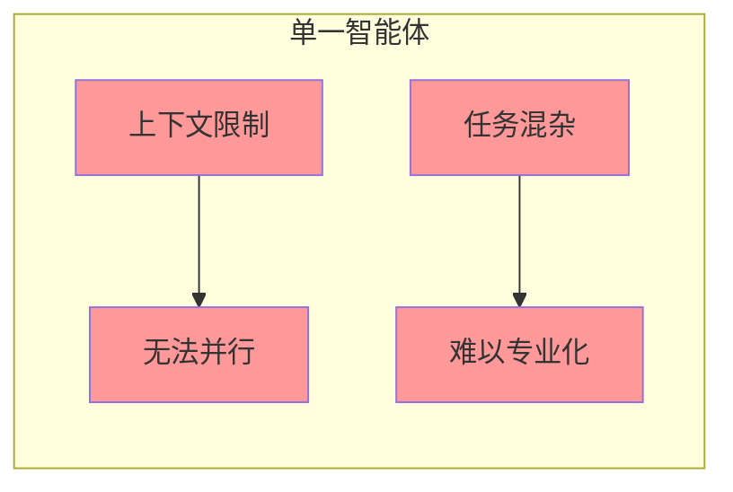
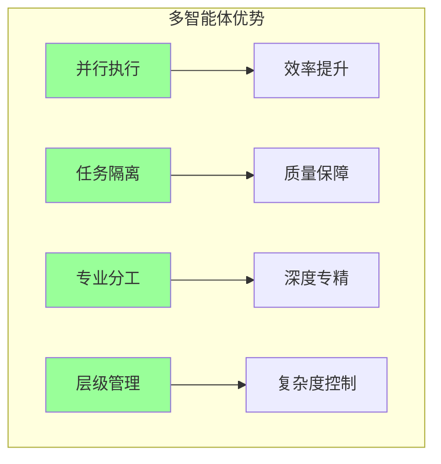
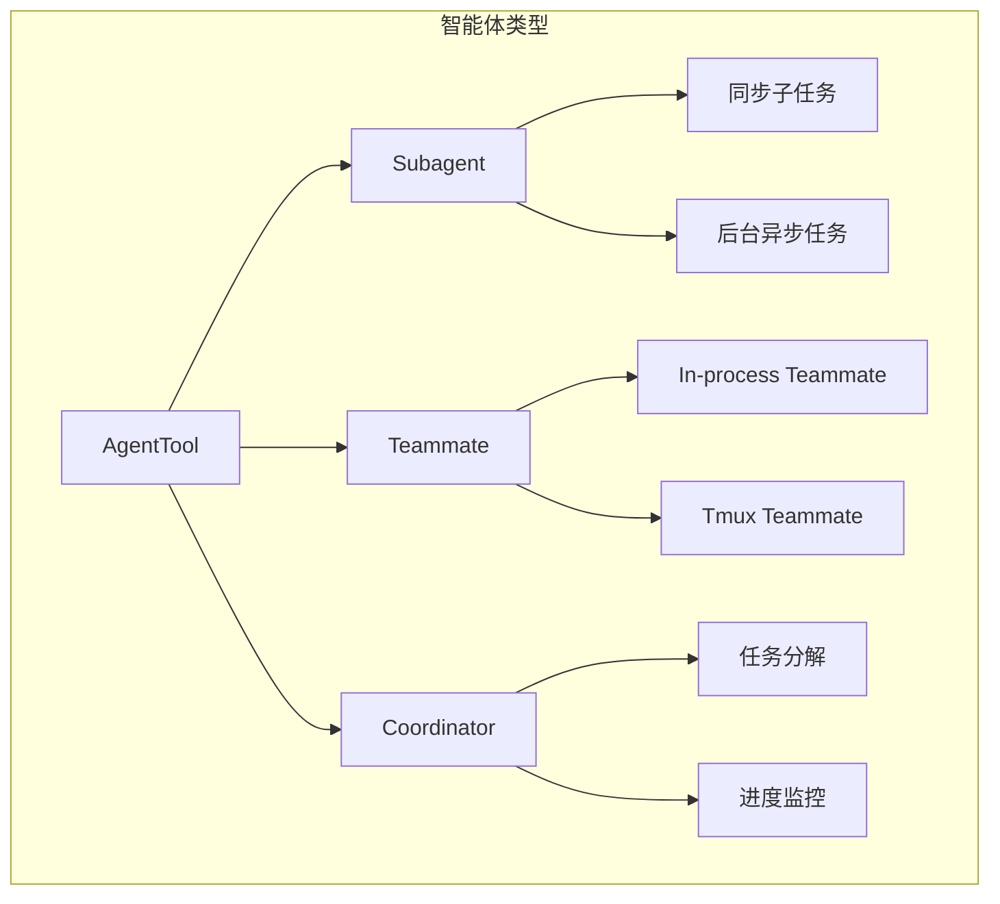
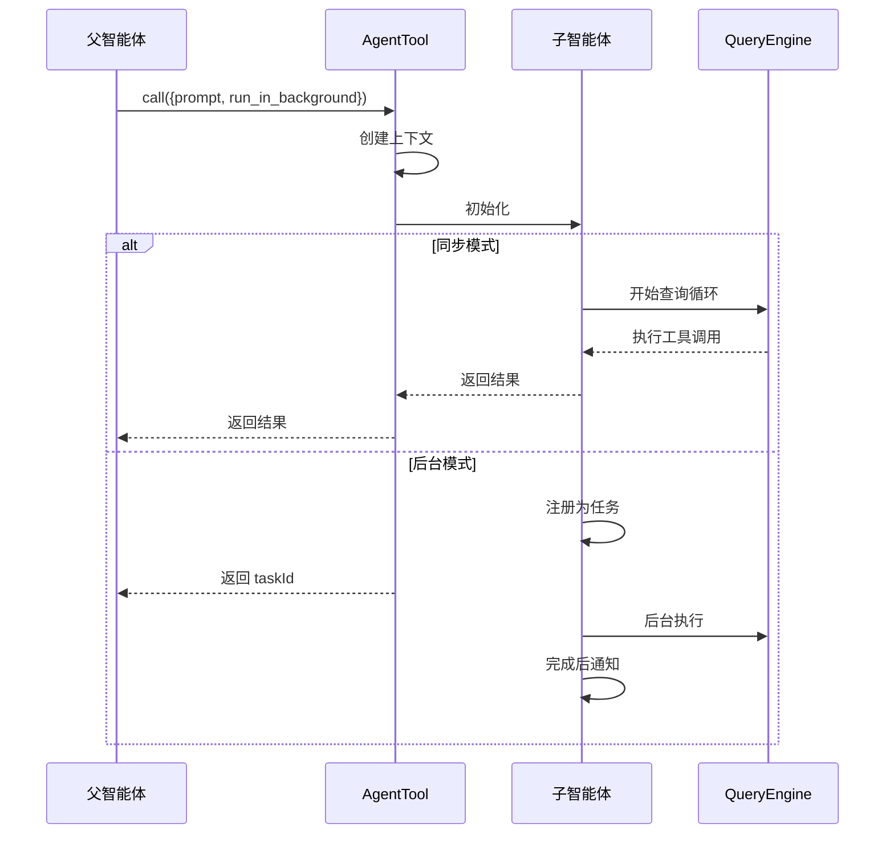
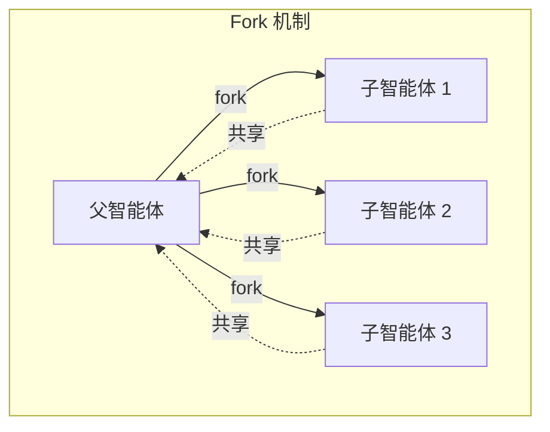
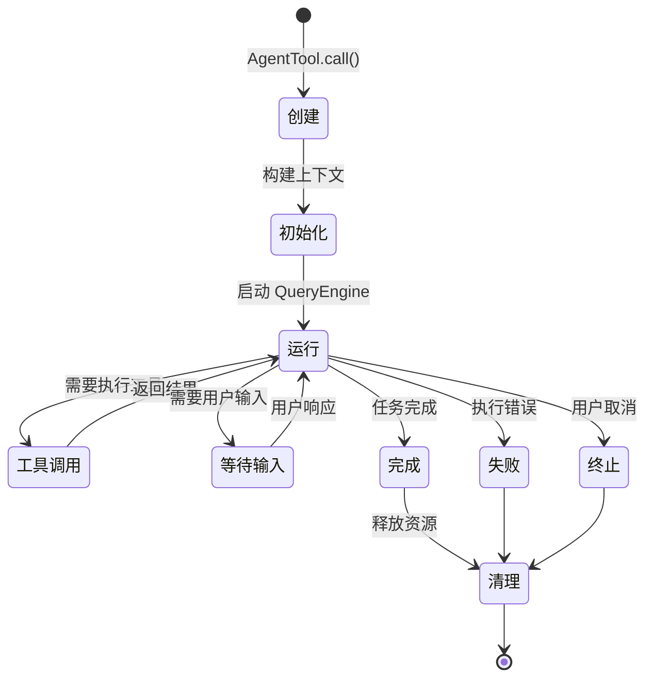
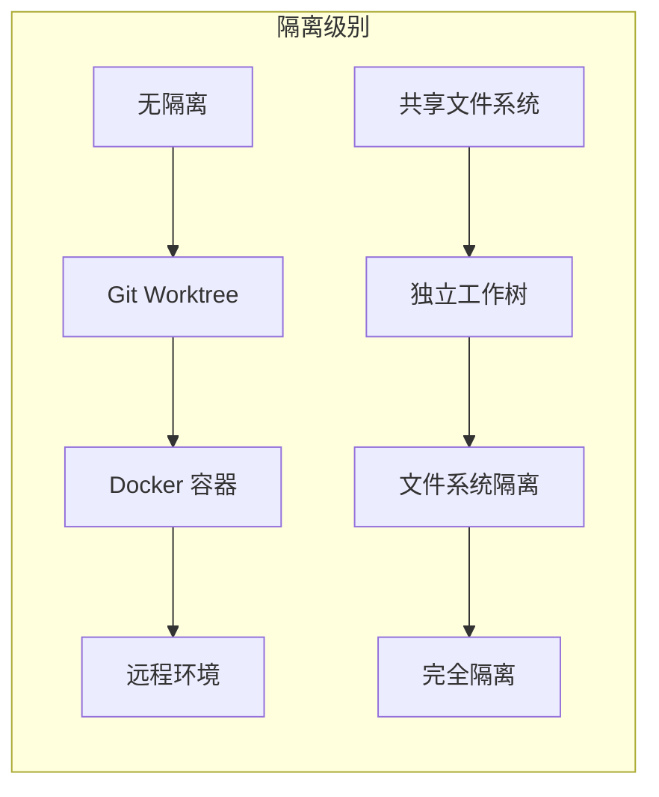
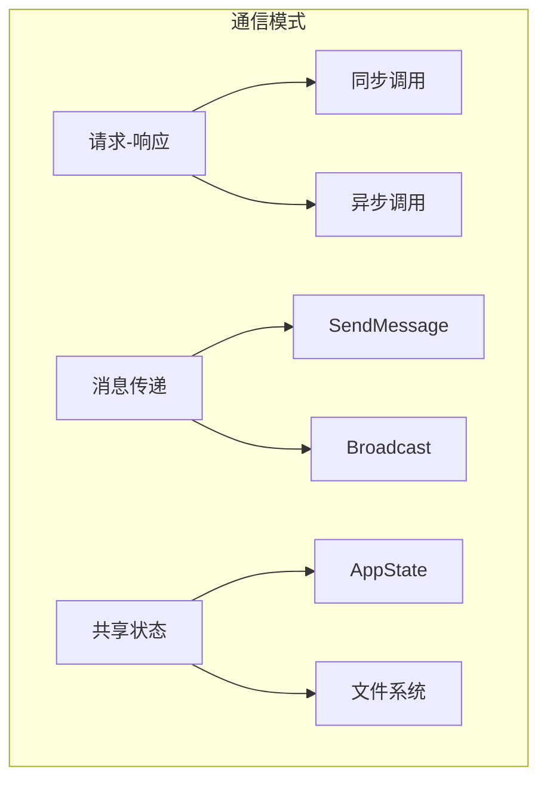

# 第6章 多智能体架构

> "单个大脑有极限，多个大脑有无限可能。"
> —— 《Claude Code 设计哲学》

多智能体架构是 Claude Code 最强大的特性之一。它允许一个 AI 实例（Agent）生成多个子智能体（Subagent），并行处理复杂任务。本章深入探讨多智能体的设计哲学、实现机制和实践应用。

## 6.1 为什么需要多智能体？

### 6.1.1 单一智能体的局限性

传统 AI 对话系统只有一个智能体处理所有任务，这在面对复杂场景时存在明显局限：



**具体局限：**

| 局限 | 说明 | 影响 |
|------|------|------|
| **上下文限制** | 单一会话有 Token 上限 | 大项目无法全部装入 |
| **串行处理** | 任务只能一个接一个执行 | 效率低下 |
| **上下文污染** | 不同任务相互干扰 | 输出质量下降 |
| **难以专业化** | 一个智能体身兼多职 | 无法深度专精 |

### 6.1.2 多智能体的优势



## 6.2 智能体类型

Claude Code 支持多种智能体类型，每种有不同的适用场景：



### 6.2.1 子智能体（Subagent）

子智能体是最基本的并行单元，通过 `AgentTool` 创建：

```typescript
// 同步子智能体
const result = await AgentTool.call({
  description: "分析测试失败",
  prompt: "请分析 tests/login.test.ts 失败的原因...",
  subagent_type: "code-reviewer",
  model: "haiku"
});

// 后台异步子智能体
const task = await AgentTool.call({
  description: "批量重命名",
  prompt: "将所有 Button 组件重命名为 UIButton...",
  run_in_background: true
});
```

**子智能体的生命周期：**



### 6.2.2 队友（Teammate）

队友是更高级的协作实体，支持双向通信：

```typescript
// 创建队友
await AgentTool.call({
  description: "创建数据库专家",
  prompt: "你是 PostgreSQL 专家...",
  name: "db-expert",
  team_name: "my-team",
  run_in_background: true
});

// 发送消息
await SendMessageTool.call({
  to: "db-expert",
  content: "优化这个查询..."
});
```

**队友的实现方式：**

| 类型 | 实现 | 通信方式 | 适用场景 |
|------|------|---------|---------|
| In-process | 同进程不同线程 | 内存共享 | 快速协作 |
| Tmux | 独立 tmux 窗口 | IPC | 可视化并行 |
| Remote | 远程 CCR 环境 | WebSocket | 计算密集型 |

### 6.2.3 Fork 子智能体

Fork 是 Claude Code 的特殊子智能体，它继承父智能体的完整上下文：



**Fork 的核心特性：**

1. **上下文继承**：子智能体看到父智能体的完整历史
2. **并行探索**：多个子智能体可以同时探索不同方案
3. **结果汇总**：父智能体收集并比较各子智能体的结果

```typescript
// Fork 子智能体示例
await AgentTool.call({
  description: "探索方案 A",
  prompt: "基于当前上下文，探索实现方案 A..."
  // subagent_type 省略，使用 Fork 路径
});

await AgentTool.call({
  description: "探索方案 B",
  prompt: "基于当前上下文，探索实现方案 B..."
});
```

## 6.3 智能体生命周期

### 6.3.1 完整生命周期图



### 6.3.2 状态管理

每个智能体都有其状态，存储在全局 AppState 中：

```typescript
// src/tasks/LocalAgentTask/LocalAgentTask.tsx

interface LocalAgentTaskState {
  type: 'local_agent';
  agentId: string;
  prompt: string;
  agentType: string;
  model?: string;

  // 执行状态
  status: 'pending' | 'running' | 'completed' | 'failed' | 'killed';
  progress?: AgentProgress;
  messages?: Message[];

  // 控制
  abortController?: AbortController;

  // 后台任务专用
  isBackgrounded: boolean;
  pendingMessages: string[];
}
```

## 6.4 隔离机制

### 6.4.1 隔离级别

Claude Code 提供多种隔离级别，满足不同安全需求：



| 隔离级别 | 文件系统 | 进程 | 网络 | 适用场景 |
|---------|---------|------|------|---------|
| 无隔离 | 共享 | 共享 | 共享 | 快速子任务 |
| Worktree | 部分隔离 | 共享 | 共享 | 并行开发 |
| Docker | 隔离 | 隔离 | 可控 | 敏感操作 |
| Remote | 完全隔离 | 完全隔离 | 隔离 | 不可信代码 |

### 6.4.2 Worktree 隔离详解

```typescript
// src/utils/worktree.ts

export async function createAgentWorktree(
  agentId: string,
  baseBranch: string
): Promise<WorktreeInfo> {
  // 1. 创建临时分支
  const worktreeBranch = `agent-${agentId}`;
  await exec(`git checkout -b ${worktreeBranch}`);

  // 2. 创建 worktree
  const worktreePath = `/tmp/claude-worktrees/${agentId}`;
  await exec(`git worktree add ${worktreePath} ${worktreeBranch}`);

  // 3. 设置隔离环境
  return {
    path: worktreePath,
    branch: worktreeBranch,
    baseBranch,
  };
}

export async function removeAgentWorktree(worktree: WorktreeInfo): Promise<void> {
  // 清理 worktree
  await exec(`git worktree remove ${worktree.path}`);
  await exec(`git branch -D ${worktree.branch}`);
}
```

## 6.5 智能体间通信

### 6.5.1 通信模式



### 6.5.2 SendMessage 实现

```typescript
// src/tools/SendMessageTool/SendMessageTool.ts

export const SendMessageTool = buildTool({
  name: 'SendMessage',

  inputSchema: z.object({
    to: z.string().describe('目标智能体名称'),
    content: z.string().describe('消息内容'),
  }),

  async call(input, context) {
    const { to, content } = input;

    // 1. 查找目标智能体
    const appState = context.getAppState();
    const targetAgentId = appState.agentNameRegistry.get(to);

    if (!targetAgentId) {
      return { error: `Agent '${to}' not found` };
    }

    // 2. 将消息加入目标智能体的待处理队列
    queuePendingMessage(targetAgentId, content, context.setAppState);

    // 3. 如果目标正在运行，立即通知
    notifyAgent(targetAgentId);

    return { status: 'sent' };
  },
});
```

## 6.6 AgentTool 核心实现

### 6.6.1 智能体选择逻辑

```typescript
// src/tools/AgentTool/AgentTool.tsx (简化示意)

export const AgentTool = buildTool({
  async call(input, context) {
    const {
      prompt,
      subagent_type,
      run_in_background,
      name,
      team_name,
      isolation,
    } = input;

    // 1. 判断是否为 Teammate 创建
    if (team_name && name) {
      return spawnTeammate({
        name,
        prompt,
        team_name,
        // ...
      });
    }

    // 2. 判断是否为 Fork 路径
    const isForkPath = !subagent_type && isForkSubagentEnabled();

    // 3. 选择智能体定义
    const selectedAgent = isForkPath
      ? FORK_AGENT
      : context.options.agentDefinitions.activeAgents.find(
          a => a.agentType === subagent_type
        );

    // 4. 检查 MCP 依赖
    if (selectedAgent.requiredMcpServers) {
      const hasRequiredServers = checkMcpServers(
        selectedAgent.requiredMcpServers,
        context.getAppState().mcp.clients
      );
      if (!hasRequiredServers) {
        throw new Error(`Missing required MCP servers`);
      }
    }

    // 5. 根据隔离模式创建执行环境
    switch (isolation) {
      case 'remote':
        return launchRemoteAgent({ prompt, selectedAgent });
      case 'worktree':
        return launchWorktreeAgent({ prompt, selectedAgent });
      default:
        return launchLocalAgent({
          prompt,
          selectedAgent,
          run_in_background,
        });
    }
  },
});
```

### 6.6.2 进度追踪

```typescript
// src/tasks/LocalAgentTask/LocalAgentTask.tsx

export interface AgentProgress {
  toolUseCount: number;
  tokenCount: number;
  lastActivity?: ToolActivity;
  recentActivities?: ToolActivity[];
  summary?: string;
}

export function updateProgressFromMessage(
  tracker: ProgressTracker,
  message: Message,
  resolveActivityDescription?: ActivityDescriptionResolver
): void {
  if (message.type !== 'assistant') return;

  // 更新 Token 计数
  tracker.latestInputTokens =
    message.message.usage.input_tokens +
    (message.message.usage.cache_creation_input_tokens ?? 0) +
    (message.message.usage.cache_read_input_tokens ?? 0);
  tracker.cumulativeOutputTokens += message.message.usage.output_tokens;

  // 记录工具调用
  for (const content of message.message.content) {
    if (content.type === 'tool_use') {
      tracker.toolUseCount++;
      tracker.recentActivities.push({
        toolName: content.name,
        input: content.input as Record<string, unknown>,
        activityDescription: resolveActivityDescription?.(
          content.name,
          content.input
        ),
      });
    }
  }

  // 保持最近 5 个活动
  while (tracker.recentActivities.length > MAX_RECENT_ACTIVITIES) {
    tracker.recentActivities.shift();
  }
}
```

## 6.7 实践案例

### 6.7.1 并行代码审查

```typescript
// 使用多个子智能体并行审查不同方面

async function parallelCodeReview(prFiles: string[]) {
  // 创建多个审查智能体
  const reviewers = await Promise.all([
    AgentTool.call({
      description: "安全性审查",
      prompt: "审查以下代码的安全问题：检查 SQL 注入、XSS、敏感数据泄露...",
      subagent_type: "security-reviewer",
    }),
    AgentTool.call({
      description: "性能审查",
      prompt: "审查以下代码的性能问题：检查算法复杂度、N+1 查询、内存泄漏...",
      subagent_type: "performance-reviewer",
    }),
    AgentTool.call({
      description: "架构审查",
      prompt: "审查以下代码的架构问题：检查模块化、依赖关系、设计模式...",
      subagent_type: "architecture-reviewer",
    }),
  ]);

  // 汇总结果
  return consolidateReviews(reviewers);
}
```

### 6.7.2 探索式重构

```typescript
// 使用 Fork 子智能体探索多种重构方案

async function exploratoryRefactoring(targetFile: string) {
  // 创建多个 Fork 探索不同方案
  const explorations = await Promise.all([
    AgentTool.call({
      description: "方案 A：提取类",
      prompt: `将 ${targetFile} 中的逻辑提取为独立类...`,
      // 使用 Fork 路径
    }),
    AgentTool.call({
      description: "方案 B：函数组合",
      prompt: `将 ${targetFile} 重构为纯函数组合...`,
    }),
    AgentTool.call({
      description: "方案 C：策略模式",
      prompt: `将 ${targetFile} 重构为策略模式...`,
    }),
  ]);

  // 比较各方案的优缺点
  return compareApproaches(explorations);
}
```

## 6.8 本章小结

本章深入探讨了 Claude Code 的多智能体架构：

1. **为什么需要多智能体**：突破单一智能体的上下文、并行、专业化限制
2. **三种智能体类型**：Subagent（子智能体）、Teammate（队友）、Coordinator（协调者）
3. **生命周期管理**：从创建到清理的完整状态机
4. **隔离机制**：从 Worktree 到 Remote 的多级隔离
5. **通信模式**：请求-响应、消息传递、共享状态
6. **实践案例**：并行审查、探索式重构

多智能体架构让 Claude Code 能够处理复杂的多步骤任务，是其实现"AI 成为真正搭档"愿景的关键。

在下一章中，我们将探讨 Claude Code 的开放生态——MCP 集成。

---

**延伸阅读：**
- [Multi-Agent Reinforcement Learning](https://www.cs.utexas.edu/~pstone/Papers/bib2html-links/Alonso2020.pdf)
- [Actor Model](https://en.wikipedia.org/wiki/Actor_model)
- [Git Worktree Documentation](https://git-scm.com/docs/git-worktree)

---

<div align="center">

**← [上一章：状态管理](#第5章-状态管理) | [下一章：MCP 集成 →](#第7章-mcp-集成)**

</div>
