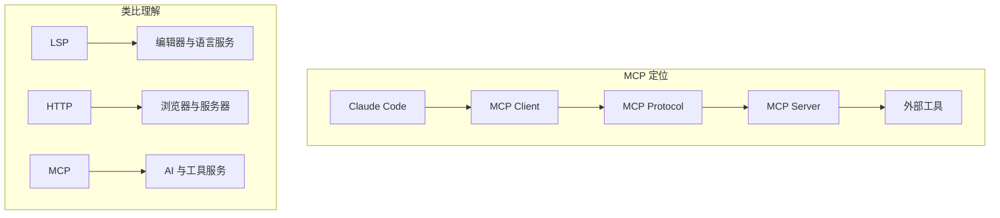
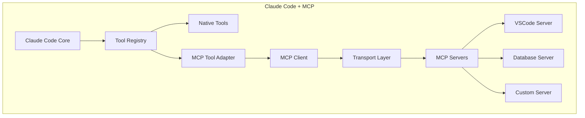
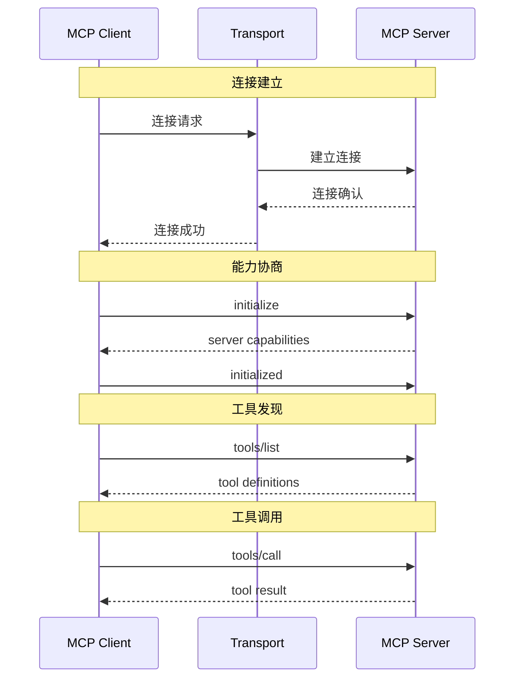
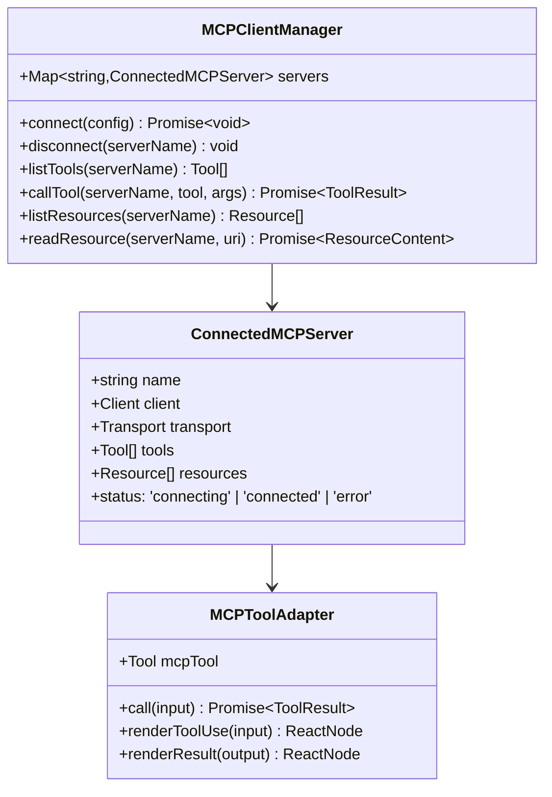
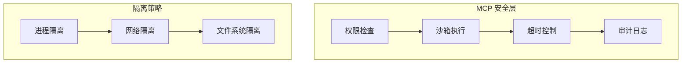

# 第7章 MCP 集成与开放生态

> "开放的生态让能力无限延伸。"
> —— MCP 设计哲学

Model Context Protocol (MCP) 是 Claude Code 的开放生态基石。它定义了标准协议，让外部工具能够无缝集成到 Claude Code 中。本章将深入探讨 MCP 的设计理念、架构实现和集成实践。

## 7.1 MCP 概述

### 7.1.1 什么是 MCP？

MCP 是 Anthropic 提出的开放协议，用于标准化 AI 与外部工具的交互方式。它类似于 LSP (Language Server Protocol)，但是面向 AI 工具而非代码编辑器。



**MCP 的核心价值：**

| 价值 | 说明 |
|------|------|
| **标准化** | 统一的工具接入协议 |
| **开放性** | 第三方可自由扩展 |
| **隔离性** | 外部工具在沙箱运行 |
| **可发现** | 自动发现可用工具 |

### 7.1.2 MCP 与 Claude Code 的关系



## 7.2 MCP 协议详解

### 7.2.1 协议架构

MCP 基于 JSON-RPC 2.0 构建，支持多种传输方式：



### 7.2.2 传输层支持

Claude Code 支持多种 MCP 传输方式：

```typescript
// src/services/mcp/client.ts

import { StdioClientTransport } from '@modelcontextprotocol/sdk/client/stdio.js'
import { SSEClientTransport } from '@modelcontextprotocol/sdk/client/sse.js'
import { StreamableHTTPClientTransport } from '@modelcontextprotocol/sdk/client/streamableHttp.js'
import { WebSocketTransport } from '../../utils/mcpWebSocketTransport.js'

type TransportType =
  | 'stdio'       // 本地子进程
  | 'sse'         // Server-Sent Events
  | 'http'        // HTTP Streaming
  | 'websocket'   // WebSocket

async function createTransport(
  type: TransportType,
  config: TransportConfig
): Promise<Transport> {
  switch (type) {
    case 'stdio':
      return new StdioClientTransport({
        command: config.command,
        args: config.args,
        env: { ...process.env, ...config.env },
      })

    case 'sse':
      return new SSEClientTransport(config.url, {
        eventSourceInit: { headers: config.headers },
      })

    case 'http':
      return new StreamableHTTPClientTransport(config.url, {
        headers: config.headers,
      })

    case 'websocket':
      return new WebSocketTransport(config.url, {
        headers: config.headers,
      })

    default:
      throw new Error(`Unknown transport type: ${type}`)
  }
}
```

### 7.2.3 消息格式

MCP 消息遵循 JSON-RPC 2.0：

```typescript
// Request
interface MCPRequest {
  jsonrpc: '2.0'
  id: string | number
  method: string
  params?: unknown
}

// Response
interface MCPResponse {
  jsonrpc: '2.0'
  id: string | number
  result?: unknown
  error?: {
    code: number
    message: string
    data?: unknown
  }
}

// Notification（无需响应）
interface MCPNotification {
  jsonrpc: '2.0'
  method: string
  params?: unknown
}
```

**工具调用示例：**

```json
// Request
{
  "jsonrpc": "2.0",
  "id": 1,
  "method": "tools/call",
  "params": {
    "name": "get_diagnostics",
    "arguments": {
      "file": "src/main.ts"
    }
  }
}

// Response
{
  "jsonrpc": "2.0",
  "id": 1,
  "result": {
    "content": [
      {
        "type": "text",
        "text": "Found 3 errors..."
      }
    ],
    "isError": false
  }
}
```

## 7.3 MCP Client 实现

### 7.3.1 Client 架构



### 7.3.2 连接管理

```typescript
// src/services/mcp/client.ts

export class MCPClientManager {
  private servers = new Map<string, ConnectedMCPServer>()

  async connect(config: McpServerConfig): Promise<void> {
    const { name, transport: transportType, ...transportConfig } = config

    try {
      // 1. 创建传输层
      const transport = await createTransport(transportType, transportConfig)

      // 2. 创建 MCP Client
      const client = new Client({ name: 'claude-code', version: VERSION })

      // 3. 建立连接
      await client.connect(transport)

      // 4. 协商能力
      const initResult = await client.initialize({
        protocolVersion: '2024-11-05',
        capabilities: {
          tools: {},
          resources: {},
          prompts: {},
        },
        clientInfo: { name: 'claude-code', version: VERSION },
      })

      // 5. 获取工具列表
      const toolsResult = await client.listTools()

      // 6. 注册服务器
      const server: ConnectedMCPServer = {
        name,
        client,
        transport,
        tools: toolsResult.tools,
        resources: [],
        status: 'connected',
      }

      this.servers.set(name, server)

      // 7. 更新 AppState
      setAppState(prev => ({
        ...prev,
        mcp: {
          ...prev.mcp,
          clients: [...prev.mcp.clients, { name, type: 'connected' }],
          tools: [...prev.mcp.tools, ...toolsResult.tools.map(t =>
            createMcpToolAdapter(server, t)
          )],
        },
      }))

    } catch (error) {
      logMCPError(`Failed to connect to MCP server ${name}:`, error)
      throw error
    }
  }

  async callTool(
    serverName: string,
    toolName: string,
    args: Record<string, unknown>
  ): Promise<ToolResult> {
    const server = this.servers.get(serverName)
    if (!server) {
      throw new Error(`MCP server ${serverName} not found`)
    }

    const result = await server.client.callTool({
      name: toolName,
      arguments: args,
    })

    return normalizeMcpResult(result)
  }
}
```

### 7.3.3 工具适配器

MCP 工具需要适配为 Claude Code 的 Tool 接口：

```typescript
// src/tools/MCPTool/MCPTool.ts

export function createMcpToolAdapter(
  server: ConnectedMCPServer,
  mcpTool: MCPToolDefinition
): Tool {
  return buildTool({
    // MCP 工具名格式：mcp__{serverName}__{toolName}
    name: buildMcpToolName(server.name, mcpTool.name),

    // 从 MCP 定义转换
    description: mcpTool.description,
    inputSchema: mcpTool.inputSchema,

    // 调用转发到 MCP Server
    async call(input, context) {
      const result = await mcpClientManager.callTool(
        server.name,
        mcpTool.name,
        input
      )

      // 处理 MCP 结果
      if (result.isError) {
        return {
          error: result.content.map(c => c.text).join(''),
        }
      }

      // 转换内容为 Claude Code 格式
      return {
        data: result.content.map(c => ({
          type: c.type,
          content: c.text || c.data,
        })),
      }
    },

    // 自定义 UI 渲染
    renderToolUseMessage(input) {
      return <McpToolUseView server={server.name} tool={mcpTool.name} />
    },

    renderToolResultMessage(output) {
      return <McpResultView content={output.data} />
    },
  })
}
```

## 7.4 配置与发现

### 7.4.1 配置文件

MCP 服务器通过配置文件声明：

```json
// .claude/mcp.json
{
  "mcpServers": {
    "vscode": {
      "command": "node",
      "args": ["/path/to/vscode-mcp-server/dist/index.js"],
      "transport": "stdio",
      "env": {
        "VSCODE_PID": "${env:VSCODE_PID}"
      }
    },
    "postgres": {
      "url": "http://localhost:3000/mcp",
      "transport": "http",
      "headers": {
        "Authorization": "Bearer ${env:PG_TOKEN}"
      }
    },
    "github": {
      "url": "https://api.github.com/mcp",
      "transport": "sse",
      "oauth": {
        "provider": "github",
        "scopes": ["repo", "read:user"]
      }
    }
  }
}
```

### 7.4.2 自动发现

Claude Code 支持自动发现 MCP 服务器：

```typescript
// src/services/mcp/discovery.ts

export async function discoverMcpServers(): Promise<McpServerConfig[]> {
  const servers: McpServerConfig[] = []

  // 1. 从配置文件
  const configPath = path.join(getCwd(), '.claude', 'mcp.json')
  if (await fileExists(configPath)) {
    const config = await readJson(configPath)
    servers.push(...Object.entries(config.mcpServers).map(([name, cfg]) =>
      ({ name, ...cfg })
    ))
  }

  // 2. 从环境变量
  if (process.env.MCP_SERVERS) {
    const envServers = JSON.parse(process.env.MCP_SERVERS)
    servers.push(...envServers)
  }

  // 3. 从插件声明
  const plugins = await loadPlugins()
  for (const plugin of plugins) {
    if (plugin.mcpServers) {
      servers.push(...plugin.mcpServers)
    }
  }

  return servers
}
```

## 7.5 安全与隔离

### 7.5.1 安全架构



### 7.5.2 安全实现

```typescript
// src/services/mcp/security.ts

interface MCPSecurityPolicy {
  // 允许调用的工具白名单
  allowedTools?: string[]

  // 禁止的工具黑名单
  deniedTools?: string[]

  // 超时限制
  timeoutMs: number

  // 是否允许网络访问
  allowNetwork: boolean

  // 允许的文件系统访问路径
  allowedPaths?: string[]
}

async function executeWithSandbox<T>(
  server: ConnectedMCPServer,
  operation: () => Promise<T>,
  policy: MCPSecurityPolicy
): Promise<T> {
  // 1. 设置超时
  const timeoutPromise = sleep(policy.timeoutMs).then(() => {
    throw new Error(`MCP operation timed out after ${policy.timeoutMs}ms`)
  })

  // 2. 执行操作
  const resultPromise = operation()

  // 3. 竞争超时
  return Promise.race([resultPromise, timeoutPromise])
}

// 权限检查
function checkMcpToolPermission(
  toolName: string,
  context: ToolPermissionContext
): PermissionResult {
  // 检查 MCP 工具权限规则
  const mcpRule = context.mcpToolRules.find(r =>
    r.pattern.test(toolName)
  )

  if (mcpRule?.behavior === 'deny') {
    return { behavior: 'deny', reason: 'MCP tool denied by policy' }
  }

  return { behavior: 'allow' }
}
```

## 7.6 实践案例

### 7.6.1 VSCode 集成

```typescript
// 配置 VSCode MCP Server
{
  "mcpServers": {
    "vscode": {
      "command": "code",
      "args": ["--mcp-server"],
      "transport": "stdio"
    }
  }
}

// 使用示例
const result = await MCPTool.call({
  server: "vscode",
  tool: "get_diagnostics",
  args: { file: "src/main.ts" }
})
```

### 7.6.2 数据库集成

```typescript
// PostgreSQL MCP Server
{
  "mcpServers": {
    "postgres": {
      "command": "npx",
      "args": ["-y", "@modelcontextprotocol/server-postgres"],
      "env": {
        "DATABASE_URL": "postgresql://..."
      }
    }
  }
}

// 使用示例
const schema = await MCPTool.call({
  server: "postgres",
  tool: "get_schema",
  args: { table: "users" }
})
```

## 7.7 本章小结

本章深入探讨了 Claude Code 的 MCP 集成：

1. **MCP 概述**：标准化、开放、隔离的协议
2. **协议架构**：JSON-RPC 2.0 基础，多传输支持
3. **Client 实现**：连接管理、工具适配、错误处理
4. **配置与发现**：配置文件、自动发现、环境变量
5. **安全隔离**：权限控制、沙箱执行、超时限制
6. **实践案例**：VSCode、数据库等集成

MCP 让 Claude Code 的能力无限延伸，构建真正的开放生态。

在下一章中，我们将探讨 Claude Code 的性能优化策略。

---

<div align="center">

**← [上一章：多智能体](#第6章-多智能体) | [下一章：性能优化 →](#第8章-性能优化)**

</div>
