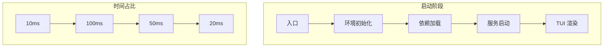
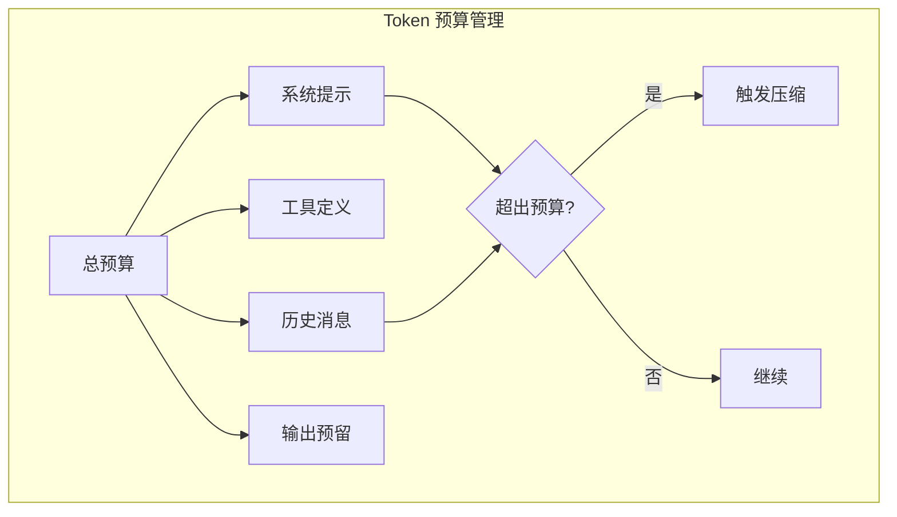
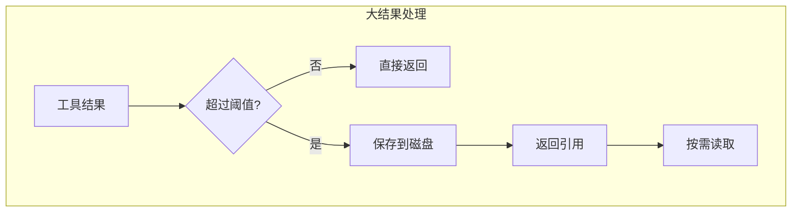

# 第8章 性能优化策略

> "性能不是特性，而是用户体验的基础。"
> —— 《Claude Code 设计哲学》

Claude Code 需要处理复杂的 AI 对话、工具执行和状态管理。本章深入探讨其性能优化策略，涵盖启动优化、运行时优化和内存管理。

## 8.1 启动优化

### 8.1.1 启动流程分析



**Claude Code 启动时间分解：**

| 阶段 | 耗时 | 主要操作 |
|------|------|---------|
| 环境初始化 | ~10ms | 特性标志、配置加载 |
| 依赖加载 | ~100ms | 模块导入、代码编译 |
| 服务启动 | ~50ms | MCP 连接、LSP 启动 |
| TUI 渲染 | ~20ms | React 渲染、首次绘制 |

### 8.1.2 并行加载

```typescript
// src/main.tsx

async function initializeServices() {
  // ❌ 串行加载（慢）
  // await loadPlugins()
  // await initializeMcp()
  // await loadSkills()

  // ✅ 并行加载（快）
  const [plugins, mcp, skills] = await Promise.all([
    loadPlugins(),
    initializeMcp(),
    loadSkills(),
  ])

  return { plugins, mcp, skills }
}
```

### 8.1.3 延迟加载

```typescript
// src/main.tsx

// 延迟加载避免循环依赖和减少初始 bundle
const getTeammateUtils = () => require('./utils/teammate.js')

// 在需要时调用
function someFunction() {
  const { getTeammateId } = getTeammateUtils()
  // ...
}

// 特性标志控制的延迟加载
const coordinatorModeModule = feature('COORDINATOR_MODE')
  ? require('./coordinator/coordinatorMode.js')
  : null
```

### 8.1.4 预取策略

```typescript
// src/main.tsx

// 在模块加载阶段就开始异步操作
import { startMdmRawRead } from './utils/settings/mdm/rawRead.js'
startMdmRawRead() // 后台启动 MDM 读取

import { startKeychainPrefetch } from './utils/secureStorage/keychainPrefetch.js'
startKeychainPrefetch() // 后台预取 keychain

// 主流程继续，异步操作并行执行
```

### 8.1.5 编译时优化

使用 Bun 的 `feature()` 实现死代码消除：

```typescript
// src/main.tsx

import { feature } from 'bun:bundle'

// 特性标志控制的代码在编译时确定
const assistantModule = feature('KAIROS')
  ? require('./assistant/index.js')
  : null

// 当 feature('KAIROS') 为 false 时，require 语句被完全移除
// 不会出现在最终 bundle 中
```

**编译时优化的好处：**

| 好处 | 说明 |
|------|------|
| 零运行时开销 | 条件判断在编译期完成 |
| 更小的 bundle | 未使用的代码被移除 |
| 更快的启动 | 无需加载未使用的模块 |

## 8.2 运行时优化

### 8.2.1 Token 预算管理



```typescript
// src/utils/context.ts

interface TokenBudget {
  maxTokens: number      // 模型最大 Token
  usedTokens: number     // 已使用 Token
  reservedTokens: number // 预留输出 Token
  availableTokens: number // 可用 Token
}

function calculateTokenBudget(
  messages: Message[],
  tools: Tool[]
): TokenBudget {
  const systemTokens = countTokens(getSystemPrompt())
  const toolTokens = countTokens(tools.map(t => t.description).join('\n'))
  const messageTokens = messages.reduce(
    (sum, m) => sum + countTokens(m.content),
    0
  )

  const maxTokens = getContextWindowForModel(getMainLoopModel())
  const reservedTokens = maxTokens * 0.15  // 预留 15% 给输出

  return {
    maxTokens,
    usedTokens: systemTokens + toolTokens + messageTokens,
    reservedTokens,
    availableTokens: maxTokens - systemTokens - toolTokens - messageTokens - reservedTokens,
  }
}

// 接近限制时触发压缩
if (budget.availableTokens < COMPACT_THRESHOLD) {
  await compactHistory(messages)
}
```

### 8.2.2 上下文压缩

```typescript
// src/services/compact/compact.ts

interface CompactStrategy {
  name: string
  canCompact(messages: Message[]): boolean
  compact(messages: Message[]): CompactResult
}

// 策略 1：摘要压缩
const summaryStrategy: CompactStrategy = {
  name: 'summary',
  canCompact: (msgs) => msgs.length > 10,
  compact: async (msgs) => {
    const oldMessages = msgs.slice(0, msgs.length - 5)
    const recentMessages = msgs.slice(-5)

    const summary = await generateSummary(oldMessages)

    return {
      messages: [
        { role: 'system', content: `Previous conversation summary: ${summary}` },
        ...recentMessages,
      ],
      summary,
    }
  },
}

// 策略 2：截断压缩
const truncationStrategy: CompactStrategy = {
  name: 'truncation',
  canCompact: () => true,
  compact: (msgs) => ({
    messages: msgs.slice(-MAX_MESSAGES),
    removed: msgs.length - MAX_MESSAGES,
  }),
}

// 策略 3：Snip 压缩（标记可跳过部分）
const snipStrategy: CompactStrategy = {
  name: 'snip',
  canCompact: (msgs) => hasLargeToolResults(msgs),
  compact: (msgs) => ({
    messages: msgs.map(m =>
      hasLargeToolResult(m)
        ? { ...m, content: snipContent(m.content) }
        : m
    ),
  }),
}
```

### 8.2.3 智能缓存

```typescript
// src/utils/fileStateCache.ts

import { LRUCache } from 'lru-cache'

interface FileStateCache {
  content: string
  timestamp: number
  isPartialView: boolean
  offset?: number
  limit?: number
}

// LRU 缓存文件状态
const fileCache = new LRUCache<string, FileStateCache>({
  maxSize: 1000,
  ttl: 60000,
  sizeCalculation: (value) => value.content.length,
})

export function getCachedFileState(path: string): FileStateCache | undefined {
  return fileCache.get(path)
}

export function setCachedFileState(
  path: string,
  state: FileStateCache
): void {
  fileCache.set(path, state)
}

// 权限决策缓存
const permissionCache = new Map<string, { result: PermissionResult; timestamp: number }>()

export function getCachedPermission(
  toolName: string,
  input: unknown
): PermissionResult | undefined {
  const key = `${toolName}:${hashInput(input)}`
  const cached = permissionCache.get(key)

  if (cached && Date.now() - cached.timestamp < PERMISSION_CACHE_TTL) {
    return cached.result
  }

  return undefined
}
```

### 8.2.4 防抖与节流

```typescript
// src/utils/debounce.ts

export function debounce<T extends (...args: unknown[]) => unknown>(
  fn: T,
  delay: number
): (...args: Parameters<T>) => void {
  let timeoutId: ReturnType<typeof setTimeout>

  return (...args) => {
    clearTimeout(timeoutId)
    timeoutId = setTimeout(() => fn(...args), delay)
  }
}

// 应用：状态保存
const debouncedSave = debounce(saveSessionSnapshot, 5000)

onChangeAppState((newState) => {
  debouncedSave(newState)
})

// 节流：限制更新频率
export function throttle<T extends (...args: unknown[]) => unknown>(
  fn: T,
  limit: number
): (...args: Parameters<T>) => void {
  let inThrottle = false

  return (...args) => {
    if (!inThrottle) {
      fn(...args)
      inThrottle = true
      setTimeout(() => inThrottle = false, limit)
    }
  }
}

// 应用：UI 更新
const throttledUpdate = throttle(updateProgressBar, 100)
```

## 8.3 内存管理

### 8.3.1 大结果处理



```typescript
// src/utils/toolResultStorage.ts

const MAX_RESULT_SIZE_CHARS = 100_000

export async function handleLargeToolResult(
  result: ToolResult
): Promise<ToolResult> {
  const resultSize = JSON.stringify(result).length

  if (resultSize < MAX_RESULT_SIZE_CHARS) {
    return result  // 小结果直接返回
  }

  // 大结果保存到磁盘
  const resultPath = await persistToolResult(result)

  // 生成预览
  const preview = generatePreview(result, PREVIEW_SIZE)

  return {
    type: 'file_reference',
    path: resultPath,
    preview,
    fullSize: resultSize,
  }
}

async function persistToolResult(result: ToolResult): Promise<string> {
  const path = generateTempFilePath('tool-result-', '.json')
  await writeFile(path, JSON.stringify(result))
  return path
}
```

### 8.3.2 消息历史管理

```typescript
// src/utils/messages.ts

const MAX_MESSAGES_IN_MEMORY = 1000

export function trimMessageHistory(messages: Message[]): Message[] {
  if (messages.length <= MAX_MESSAGES_IN_MEMORY) {
    return messages
  }

  // 保留系统消息和最近的对话
  const systemMessages = messages.filter(m => m.role === 'system')
  const recentMessages = messages.slice(-MAX_MESSAGES_IN_MEMORY / 2)

  return [...systemMessages, ...recentMessages]
}
```

### 8.3.3 垃圾回收优化

```typescript
// src/utils/cleanupRegistry.ts

interface CleanupEntry {
  id: string
  cleanup: () => void
  priority: number
}

const cleanupRegistry: CleanupEntry[] = []

export function registerCleanup(
  cleanup: () => void,
  priority = 0
): () => void {
  const id = generateId()
  cleanupRegistry.push({ id, cleanup, priority })

  // 返回取消注册函数
  return () => {
    const index = cleanupRegistry.findIndex(e => e.id === id)
    if (index !== -1) {
      cleanupRegistry.splice(index, 1)
    }
  }
}

export async function runCleanup(): Promise<void> {
  // 按优先级排序执行清理
  const sorted = [...cleanupRegistry].sort((a, b) => b.priority - a.priority)

  for (const entry of sorted) {
    try {
      entry.cleanup()
    } catch (error) {
      logError(`Cleanup failed for ${entry.id}:`, error)
    }
  }

  cleanupRegistry.length = 0
}
```

## 8.4 渲染优化

### 8.4.1 React 优化

```typescript
// src/components/Messages.tsx

import { memo, useMemo, useCallback } from 'react'

// 使用 memo 避免不必要的重渲染
const MessageItem = memo(function MessageItem({ message }: { message: Message }) {
  return (
    <Box>
      <Text>{message.content}</Text>
    </Box>
  )
}, (prev, next) => {
  // 自定义比较函数
  return prev.message.id === next.message.id
})

// 使用 useMemo 缓存计算结果
function MessageList({ messages }: { messages: Message[] }) {
  const groupedMessages = useMemo(() => {
    return groupMessagesByDate(messages)
  }, [messages])

  // 使用 useCallback 缓存回调
  const handleRetry = useCallback((messageId: string) => {
    retryMessage(messageId)
  }, [])

  return (
    <Box>
      {groupedMessages.map(group => (
        <MessageGroup
          key={group.date}
          group={group}
          onRetry={handleRetry}
        />
      ))}
    </Box>
  )
}
```

### 8.4.2 虚拟滚动

```typescript
// src/components/VirtualMessageList.tsx

interface VirtualListProps {
  items: Message[]
  itemHeight: number
  windowHeight: number
}

export function VirtualMessageList({
  items,
  itemHeight,
  windowHeight,
}: VirtualListProps) {
  const [scrollTop, setScrollTop] = useState(0)

  // 计算可见范围
  const startIndex = Math.floor(scrollTop / itemHeight)
  const endIndex = Math.min(
    startIndex + Math.ceil(windowHeight / itemHeight),
    items.length
  )

  const visibleItems = items.slice(startIndex, endIndex)
  const offsetY = startIndex * itemHeight

  return (
    <Box
      height={windowHeight}
      onScroll={e => setScrollTop(e.scrollTop)}
    >
      <Box height={items.length * itemHeight}>
        <Box marginTop={offsetY}>
          {visibleItems.map((item, index) => (
            <MessageItem
              key={item.id}
              message={item}
              height={itemHeight}
            />
          ))}
        </Box>
      </Box>
    </Box>
  )
}
```

## 8.5 性能监控

### 8.5.1 启动性能分析

```typescript
// src/utils/startupProfiler.ts

interface Checkpoint {
  name: string
  timestamp: number
  elapsed: number
}

const checkpoints: Checkpoint[] = []

export function profileCheckpoint(name: string): void {
  const now = performance.now()
  const elapsed = checkpoints.length > 0
    ? now - checkpoints[0].timestamp
    : 0

  checkpoints.push({ name, timestamp: now, elapsed })
}

export function profileReport(): void {
  console.log('Startup Profile:')
  checkpoints.forEach((cp, i) => {
    const duration = i > 0
      ? cp.timestamp - checkpoints[i - 1].timestamp
      : 0
    console.log(`  ${cp.name}: ${duration.toFixed(2)}ms (total: ${cp.elapsed.toFixed(2)}ms)`)
  })
}

// 使用
profileCheckpoint('main_tsx_entry')
// ... 加载模块 ...
profileCheckpoint('imports_loaded')
// ... 初始化服务 ...
profileCheckpoint('services_ready')
// ...
profileReport()
```

### 8.5.2 运行时性能指标

```typescript
// src/utils/performance.ts

interface PerformanceMetrics {
  // API 调用
  apiCalls: number
  apiDuration: number
  apiTokens: number

  // 工具执行
  toolCalls: number
  toolDuration: number

  // 渲染
  renderCount: number
  renderDuration: number
}

const metrics: PerformanceMetrics = {
  apiCalls: 0,
  apiDuration: 0,
  apiTokens: 0,
  toolCalls: 0,
  toolDuration: 0,
  renderCount: 0,
  renderDuration: 0,
}

export function recordApiCall(duration: number, tokens: number): void {
  metrics.apiCalls++
  metrics.apiDuration += duration
  metrics.apiTokens += tokens
}

export function recordToolCall(duration: number): void {
  metrics.toolCalls++
  metrics.toolDuration += duration
}

export function getPerformanceReport(): string {
  return `
Performance Report:
  API: ${metrics.apiCalls} calls, ${metrics.apiDuration}ms total, ${metrics.apiTokens} tokens
  Tools: ${metrics.toolCalls} calls, ${metrics.toolDuration}ms total
  Renders: ${metrics.renderCount}, ${metrics.renderDuration}ms total
  `
}
```

## 8.6 本章小结

本章深入探讨了 Claude Code 的性能优化策略：

1. **启动优化**：并行加载、延迟加载、预取、编译时优化
2. **运行时优化**：Token 预算、上下文压缩、智能缓存、防抖节流
3. **内存管理**：大结果处理、消息历史管理、垃圾回收
4. **渲染优化**：React memo、虚拟滚动
5. **性能监控**：启动分析、运行时指标

这些优化策略共同确保了 Claude Code 的流畅体验。

在下一章中，我们将总结设计模式和最佳实践。

---

<div align="center">

**← [上一章：MCP 集成](#第7章-mcp-集成) | [下一章：设计模式 →](#第9章-设计模式)**

</div>
