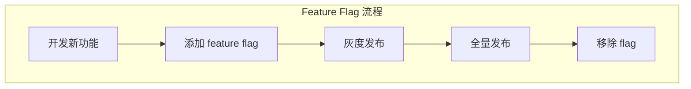

# 第9章 设计模式与最佳实践

> "好的代码不是写出来的，是经过反复提炼的。"
> —— 《Claude Code 设计哲学》

本章总结 Claude Code 中反复出现的设计模式和最佳实践，帮助读者在自己的项目中应用这些经验。

## 9.1 核心设计模式

### 9.1.1 特性标志驱动开发



```typescript
// 使用 Bun 的 feature() 实现编译时特性标志
import { feature } from 'bun:bundle'

// 特性标志控制的代码
const coordinatorMode = feature('COORDINATOR_MODE')
  ? require('./coordinator/coordinatorMode.js')
  : null

// 运行时检查
if (feature('TRANSCRIPT_CLASSIFIER')) {
  enableAutoMode()
}
```

**特性标志的优势：**

| 优势 | 说明 |
|------|------|
| 零运行时开销 | 编译时确定，无运行时检查 |
| 死代码消除 | 未使用的代码不会打包 |
| 渐进发布 | 可以控制功能上线节奏 |
| 快速回滚 | 发现问题立即关闭 |

### 9.1.2 延迟加载模式

```typescript
// 避免循环依赖和减少初始加载

// ❌ 直接导入（可能造成循环依赖）
import { teammateUtils } from './utils/teammate.js'

// ✅ 延迟加载
const getTeammateUtils = () => require('./utils/teammate.js')

// 在函数内部使用
function processTeammate() {
  const { getTeammateId } = getTeammateUtils()
  return getTeammateId()
}
```

### 9.1.3 依赖注入

```typescript
// ❌ 全局导入（紧耦合）
import { getAppState } from './state/AppState.js'

function doSomething() {
  const state = getAppState() // 隐式依赖
}

// ✅ 依赖注入（松耦合）
interface ToolUseContext {
  getAppState(): AppState
  setAppState(f: (prev: AppState) => AppState): void
}

function doSomething(context: ToolUseContext) {
  const state = context.getAppState() // 显式依赖
}
```

### 9.1.4 Builder 模式

```typescript
// src/Tool.ts

export function buildTool<D extends AnyToolDef>(def: D): BuiltTool<D> {
  const TOOL_DEFAULTS = {
    isEnabled: () => true,
    isConcurrencySafe: () => false,
    isReadOnly: () => false,
    isDestructive: () => false,
    checkPermissions: async (input) => ({
      behavior: 'allow',
      updatedInput: input,
    }),
  }

  return {
    ...TOOL_DEFAULTS,
    ...def,
  } as BuiltTool<D>
}

// 使用
const MyTool = buildTool({
  name: 'MyTool',
  description: 'My tool',
  // 只需要覆盖需要自定义的方法
  async call(input) {
    // ...
  },
})
```

### 9.1.5 策略模式

```typescript
// src/services/compact/compact.ts

interface CompactStrategy {
  name: string
  canCompact(messages: Message[]): boolean
  compact(messages: Message[]): CompactResult
}

const strategies: CompactStrategy[] = [
  summaryStrategy,
  truncationStrategy,
  snipStrategy,
]

export function compactMessages(messages: Message[]): Message[] {
  for (const strategy of strategies) {
    if (strategy.canCompact(messages)) {
      return strategy.compact(messages).messages
    }
  }
  return messages
}
```

## 9.2 类型安全实践

### 9.2.1 Zod + TypeScript

```typescript
import { z } from 'zod/v4'

// 定义 Schema
const inputSchema = z.object({
  name: z.string(),
  age: z.number().optional(),
  email: z.string().email(),
})

// 推断 TypeScript 类型
type Input = z.infer<typeof inputSchema>

// 运行时验证
function process(input: unknown): Input {
  return inputSchema.parse(input) // 验证失败会抛出错误
}
```

### 9.2.2 品牌类型（Branded Types）

```typescript
// src/types/ids.ts

type Brand<K, T> = K & { __brand: T }

export type SessionId = Brand<string, 'SessionId'>
export type AgentId = Brand<string, 'AgentId'>
export type TaskId = Brand<string, 'TaskId'>

// 使用
function createSessionId(): SessionId {
  return randomUUID() as SessionId
}

// 类型安全
const sessionId: SessionId = createSessionId()
const agentId: AgentId = createAgentId()

// ❌ 编译错误：不能混用
// const wrong: SessionId = agentId
```

### 9.2.3 不可变性

```typescript
// 使用 readonly 和 DeepImmutable
type DeepImmutable<T> = {
  readonly [K in keyof T]: T[K] extends object
    ? T[K] extends Function
      ? T[K]
      : DeepImmutable<T[K]>
    : T[K]
}

// 状态更新模式
setAppState(prev => ({
  ...prev,
  messages: [...prev.messages, newMessage],
}))
```

## 9.3 错误处理

### 9.3.1 错误即值

```typescript
// ❌ 使用异常控制流程
try {
  const result = riskyOperation()
  return result
} catch (e) {
  return null
}

// ✅ 使用 Result 类型
interface Result<T, E> {
  success: boolean
  data?: T
  error?: E
}

function riskyOperation(): Result<Data, Error> {
  if (somethingWrong) {
    return { success: false, error: new Error('...') }
  }
  return { success: true, data: ... }
}
```

### 9.3.2 分层错误处理

```typescript
// 工具层错误
type ToolError =
  | { type: 'validation'; message: string }
  | { type: 'permission'; message: string }
  | { type: 'execution'; message: string; cause: Error }

// 应用层错误
type AppError =
  | { type: 'tool'; toolName: string; error: ToolError }
  | { type: 'api'; message: string }
  | { type: 'system'; message: string }

// 统一错误处理
function handleError(error: AppError): void {
  switch (error.type) {
    case 'tool':
      logToolError(error)
      showToolErrorUI(error)
      break
    case 'api':
      logApiError(error)
      showRetryDialog(error)
      break
    // ...
  }
}
```

## 9.4 测试策略

### 9.4.1 单元测试

```typescript
// MyTool.test.ts
import { describe, it, expect, vi } from 'vitest'
import { MyTool } from './MyTool.js'

describe('MyTool', () => {
  it('should validate input', async () => {
    const result = await MyTool.validateInput(
      { name: '' },
      mockContext
    )
    expect(result.result).toBe(false)
  })

  it('should execute successfully', async () => {
    const mockCanUseTool = vi.fn().mockResolvedValue({ behavior: 'allow' })

    const result = await MyTool.call(
      { name: 'test' },
      mockContext,
      mockCanUseTool
    )

    expect(result.data).toBeDefined()
  })
})
```

### 9.4.2 集成测试

```typescript
// QueryEngine.integration.test.ts
describe('QueryEngine', () => {
  it('should handle tool calls', async () => {
    const engine = createTestEngine()

    await engine.submitMessage('List files')

    await waitFor(() =>
      expect(engine.messages).toContainToolCall('Glob')
    )
  })
})
```

### 9.4.3 Mock 策略

```typescript
// 使用依赖注入便于测试
const createTestTool = (deps: {
  fs: typeof import('fs/promises')
  exec: typeof import('child_process').exec
}) => {
  return buildTool({
    name: 'TestTool',
    async call(input) {
      // 使用注入的依赖
      const content = await deps.fs.readFile(input.path)
      return { content }
    },
  })
}
```

## 9.5 代码组织

### 9.5.1 垂直切片

```
tools/
  MyTool/
    ├── index.ts      # 工具逻辑
    ├── types.ts      # 类型定义
    ├── UI.tsx        # UI 组件
    ├── utils.ts      # 辅助函数
    └── test.ts       # 测试
```

### 9.5.2 导入顺序

```typescript
// 1. 外部库
import React from 'react'
import { z } from 'zod'

// 2. 内部模块
import { buildTool } from '../../Tool.js'

// 3. 本地文件
import { renderToolUse } from './UI.js'
import type { Input, Output } from './types.js'
```

## 9.6 常见陷阱

### 9.6.1 循环依赖

```typescript
// ❌ A.ts 导入 B.ts，B.ts 导入 A.ts
// A.ts
import { B } from './B.js'
export const A = { useB: () => B }

// B.ts
import { A } from './A.js'  // 循环！
export const B = { useA: () => A }

// ✅ 解决方案：提取公共类型到单独文件
// types.ts
export interface A { ... }
export interface B { ... }

// A.ts
import type { B } from './types.js'

// B.ts
import type { A } from './types.js'
```

### 9.6.2 闭包陷阱

```typescript
// ❌ 错误的闭包使用
for (const item of items) {
  setTimeout(() => {
    console.log(item) // 可能都是最后一个
  }, 1000)
}

// ✅ 使用 let 或闭包
for (const item of items) {
  const capturedItem = item
  setTimeout(() => {
    console.log(capturedItem)
  }, 1000)
}

// ✅ 使用 forEach
items.forEach(item => {
  setTimeout(() => {
    console.log(item)
  }, 1000)
})
```

### 9.6.3 异步竞态

```typescript
// ❌ 竞态条件
let value = 0
async function increment() {
  const current = value
  await sleep(100)
  value = current + 1
}

// ✅ 使用原子操作
let value = 0
async function increment() {
  value++ // 原子操作
}

// ✅ 使用锁
const lock = new AsyncLock()
async function increment() {
  await lock.acquire(async () => {
    const current = value
    await sleep(100)
    value = current + 1
  })
}
```

## 9.7 本章小结

本章总结了 Claude Code 的核心设计模式：

1. **特性标志驱动**：编译时特性控制
2. **延迟加载**：避免循环依赖和减少初始加载
3. **依赖注入**：松耦合，易测试
4. **Builder 模式**：合理的默认值
5. **策略模式**：可插拔的算法
6. **类型安全**：Zod + TypeScript
7. **错误处理**：错误即值，分层处理
8. **测试策略**：单元测试 + 集成测试
9. **代码组织**：垂直切片
10. **常见陷阱**：循环依赖、闭包陷阱、异步竞态

在最后一章中，我们将展望 Claude Code 的未来发展。

---

<div align="center">

**← [上一章：性能优化](#第8章-性能优化) | [下一章：未来展望 →](#第10章-未来展望)**

</div>
