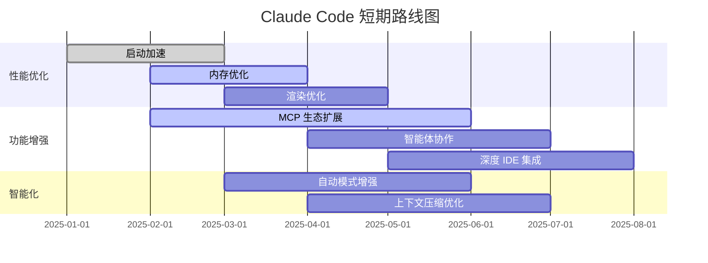
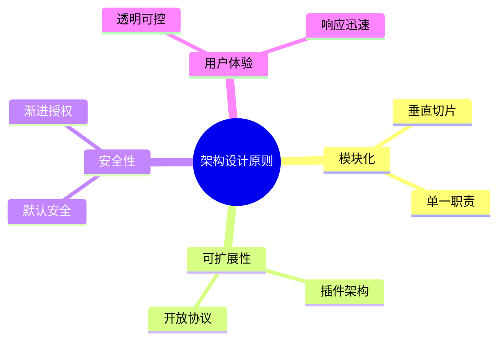

# 第10章 未来展望与附录

> "预测未来的最好方式就是创造它。"
> —— 《Claude Code 设计哲学》（化用 Alan Kay 观点）

本书的前九章深入探讨了 Claude Code 的架构与设计。本章展望其未来发展，并提供实用的附录信息。

## 10.1 演进方向

### 10.1.1 短期路线图



### 10.1.2 更智能的上下文管理

**当前挑战：**
- 长对话的上下文压缩会丢失细节
- 无法自动识别最重要的上下文

**未来方向：**


**技术方向：**

1. **关键信息识别**：自动识别对话中的关键决策点和重要信息
2. **重要性评分**：为每条消息计算重要性分数，压缩时优先保留高分内容
3. **预测性预加载**：根据用户工作模式预测需要的上下文
4. **长期记忆整合**：跨会话学习用户偏好和项目知识

### 10.1.3 更深度的 IDE 集成

**当前集成：**
- MCP 协议支持与 IDE 通信
- 文件读写操作

**未来愿景：**


**可能的实现：**

| 功能 | 描述 | 技术方案 |
|------|------|---------|
| 实时代码同步 | 代码变化实时反映 | WebSocket 双向同步 |
| 可视化 Diff | 图形化展示变更 | 集成 Monaco Diff |
| 交互式重构 | 可视化重构选项 | IDE 插件 API |
| 智能导航 | 代码结构可视化 | 语义分析 + 图形 |
| 协同编辑 | 多人同时编辑 | CRDT 算法 |

### 10.1.4 更强大的多智能体

**当前能力：**
- 子智能体并行执行
- Teammate 双向通信

**未来演进：**


**技术方向：**

1. **智能体市场**：社区共享专业智能体（代码审查专家、安全审计专家等）
2. **自动任务分解**：AI 自动将复杂任务分解给合适的子智能体
3. **智能体间学习**：子智能体的经验可以被其他智能体学习
4. **动态团队组建**：根据任务特点自动组建最优智能体团队

### 10.1.5 自然语言编程

**愿景：** 让自然语言成为一等编程语言

```
用户："创建一个处理用户注册的 API 端点，
      需要验证邮箱、检查重复、发送确认邮件"

Claude Code：
1. 设计 API 接口
2. 实现验证逻辑
3. 集成邮件服务
4. 编写测试
5. 生成文档
```

**技术挑战：**
- 自然语言的歧义性
- 需求完整性验证
- 生成的代码质量
- 可维护性保障

## 10.2 对开发者的启示

### 10.2.1 架构设计原则

从 Claude Code 学到的核心原则：



### 10.2.2 AI 应用设计要点

| 要点 | 说明 | Claude Code 实践 |
|------|------|-----------------|
| **能力透明** | 用户清楚 AI 能做什么 | 工具即界面 |
| **行为可控** | 用户可以控制 AI 行为 | 权限系统 |
| **错误可恢复** | 错误不是终点 | 会话恢复 |
| **渐进学习** | 随使用变得更智能 | 规则记忆 |
| **人机协作** | AI 辅助而非替代 | 多智能体 |

### 10.2.3 技术选型建议

**如果你要构建类似的 AI 应用：**

1. **运行时**：Bun (快速、内置打包) 或 Node.js (生态丰富)
2. **语言**：TypeScript (类型安全)
3. **状态管理**：轻量级 Store (自定义或 Zustand)
4. **UI**：Ink (TUI) 或 Electron (GUI)
5. **协议**：MCP (开放生态)

## 10.3 附录

### 10.3.1 术语表

| 术语 | 定义 |
|------|------|
| **Agent** | AI 实例，可以是主智能体或子智能体 |
| **MCP** | Model Context Protocol，模型上下文协议 |
| **QueryEngine** | Claude Code 的核心查询引擎 |
| **Tool** | AI 可调用的能力单元 |
| **Skill** | 可复用的工作流定义 |
| **CLAUDE.md** | 项目级别的 AI 上下文文件 |
| **Subagent** | 由 AgentTool 创建的子智能体 |
| **Teammate** | 可双向通信的长期智能体 |
| **Fork** | 继承完整上下文的子智能体 |
| **Permission Mode** | 权限模式（default/auto/plan等） |
| **Feature Flag** | 特性标志，控制功能开关 |

### 10.3.2 推荐阅读

**架构设计：**
- [Clean Architecture](https://blog.cleancoder.com/uncle-bob/2012/08/13/the-clean-architecture.html) - Robert C. Martin
- [Vertical Slice Architecture](https://jimmybogard.com/vertical-slice-architecture/) - Jimmy Bogard
- [Building Microservices](https://samnewman.io/books/building_microservices_2nd_edition/) - Sam Newman

**AI 与 LLM：**
- [Language Models are Few-Shot Learners](https://arxiv.org/abs/2005.14165) - GPT-3 论文
- [ReAct: Synergizing Reasoning and Acting](https://arxiv.org/abs/2210.03629) - 推理与行动结合
- [The Rise and Potential of Large Language Model Based Agents](https://arxiv.org/abs/2309.07864) - 智能体综述

**相关协议：**
- [MCP Specification](https://modelcontextprotocol.io/) - 官方文档
- [Language Server Protocol](https://microsoft.github.io/language-server-protocol/) - LSP 规范
- [JSON-RPC 2.0](https://www.jsonrpc.org/specification) - RPC 协议

### 10.3.3 源码导航

```
ClaudeCodesrc/
├── main.tsx                     # 应用入口
├── QueryEngine.ts               # 查询引擎核心
├── Tool.ts                      # 工具抽象基类
├── tools.ts                     # 工具注册
├── state/
│   ├── AppState.tsx            # React 状态管理
│   ├── AppStateStore.ts        # 状态定义
│   └── store.ts                # Store 实现
├── tools/
│   ├── BashTool/               # Bash 工具
│   ├── FileEditTool/           # 文件编辑工具
│   ├── AgentTool/              # 智能体工具
│   └── MCPTool/                # MCP 工具适配器
├── services/
│   └── mcp/
│       ├── client.ts           # MCP 客户端
│       ├── config.ts           # MCP 配置
│       └── types.ts            # MCP 类型
├── utils/
│   └── permissions/
│       ├── permissions.ts      # 权限核心
│       ├── PermissionMode.ts   # 权限模式
│       └── yoloClassifier.ts   # 自动分类器
└── types/
    └── permissions.ts          # 权限类型定义
```

### 10.3.4 调试技巧

**启动性能分析：**
```bash
# 启用启动性能分析
CLAUDE_CODE_PROFILE=1 claude

# 查看详细日志
claude --verbose
```

**工具调试：**
```typescript
// 在工具中添加调试日志
logForDebugging('MyTool input:', input)

// 查看状态变化
onChangeAppState((newState, oldState) => {
  console.log('State changed:', diff(oldState, newState))
})
```

**MCP 调试：**
```bash
# 查看 MCP 通信日志
CLAUDE_CODE_MCP_DEBUG=1 claude

# 测试 MCP 服务器
npx @modelcontextprotocol/inspector <server-command>
```

### 10.3.5 社区资源

- **官方文档**：https://docs.anthropic.com/en/docs/claude-code
- **GitHub 仓库**：https://github.com/anthropics/claude-code
- **Discord 社区**：Anthropic Community
- **Stack Overflow**：#claude-code 标签

## 10.4 结语

Claude Code 代表了 AI 辅助开发的未来方向。它不是要替代开发者，而是成为开发者的真正搭档。

通过本书的学习，我们深入理解了：

1. **设计哲学**：渐进式信任、工具即界面、上下文即代码
2. **核心架构**：分层设计、QueryEngine、状态管理
3. **工具系统**：可扩展的能力层
4. **权限系统**：安全与便利的平衡
5. **多智能体**：并行处理复杂任务
6. **MCP 集成**：开放的生态系统
7. **性能优化**：启动、运行时、内存
8. **设计模式**：可复用的架构经验

希望本书能够帮助你：
- 深入理解 Claude Code 的设计理念
- 在自己的项目中应用这些模式
- 为 Claude Code 生态做出贡献
- 构建更好的 AI 辅助工具

**最后的话：**

> AI 不是要取代人类，而是要增强人类。
> Claude Code 只是一个开始，真正的魔法发生在你使用它创造的时候。

感谢阅读。

---

<div align="center">

**← [上一章：设计模式](#第9章-设计模式)**

**全书完**

</div>

---


