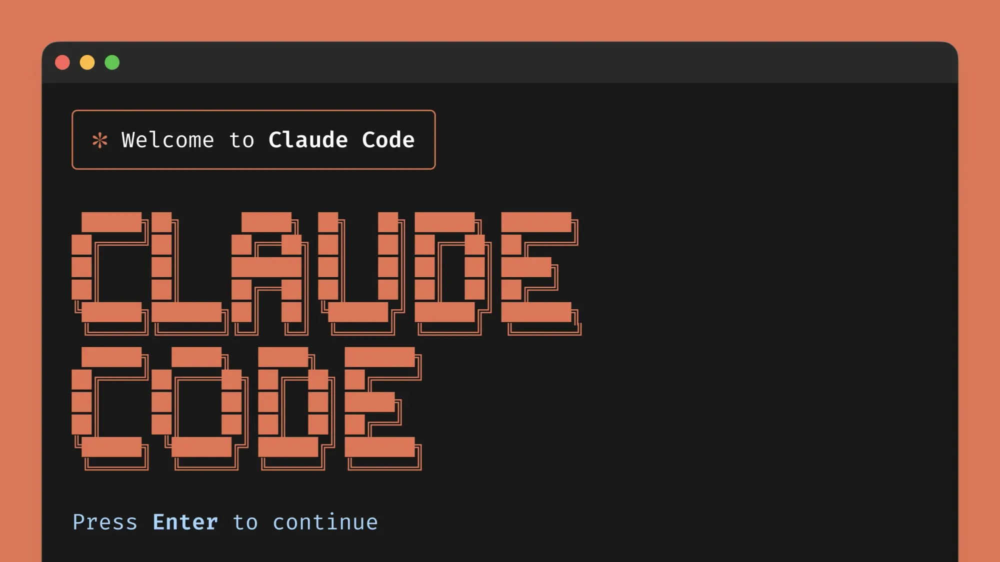
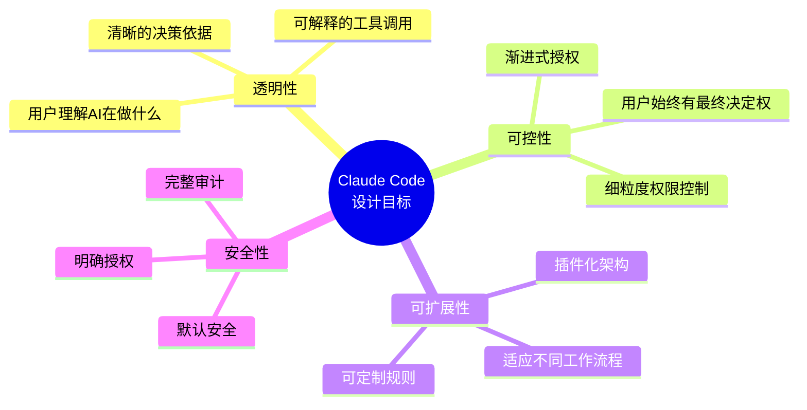

# Claude Code 设计哲学
## 构建下一代 AI 编程助手的架构之道

---

*Claude Code —— Anthropic 官方 CLI 工具*
作者：Kiki & Claude Code 

---

## 目录

- [第1章 引言：为什么设计 Claude Code](Claude%20Code%20设计哲学/chapter-01-introduction.md)
- [第2章 核心架构概览](Claude%20Code%20设计哲学/chapter-02-architecture.md)
- [第3章 工具系统详解](Claude%20Code%20设计哲学/chapter-03-tools.md)
- [第4章 权限系统深度解析](Claude%20Code%20设计哲学/chapter-04-permissions.md)
- [第5章 状态管理与响应式架构](Claude%20Code%20设计哲学/chapter-05-state.md)
- [第6章 多智能体架构](Claude%20Code%20设计哲学/chapter-06-multi-agent.md)
- [第7章 MCP 集成与开放生态](Claude%20Code%20设计哲学/chapter-07-mcp.md)
- [第8章 性能优化策略](Claude%20Code%20设计哲学/chapter-08-performance.md)
- [第9章 设计模式与最佳实践](Claude%20Code%20设计哲学/chapter-09-patterns.md)
- [第10章 未来展望与附录](Claude%20Code%20设计哲学/chapter-10-future.md)

> "Claude Code 不是又一个命令行工具。它是 Claude 能力的自然延伸——一个让 AI 成为开发者真正搭档的尝试。"
> —— 《Claude Code 设计哲学》

这本书讨论的不是单个功能，而是一整套设计选择：为什么要有工具系统、为什么权限要渐进开放、为什么状态必须可追踪、为什么多智能体和 MCP 会成为关键接口。

如果说传统 AI 编程体验更像是在屏幕另一端给建议，那么 Claude Code 更像是把 AI 放进了开发流程本身。

## 这本书讲什么

- Claude Code 的设计动机与产品定位
- 核心架构、工具调用和权限模型
- 状态管理、多智能体协作与 MCP 集成
- 性能优化、设计模式与未来演进

## 仓库内容

- `Claude Code 设计哲学/`：按章节拆分的正文
- `images/Claudecode.webp`：封面图片
- `exports/Claude Code 设计哲学.pdf`：PDF 版本

## 延伸阅读：

- [Claude Code 官方文档](https://docs.anthropic.com/en/docs/claude-code/overview)

## PDF

[下载或打开 PDF 版本](exports/Claude%20Code%20设计哲学.pdf)
